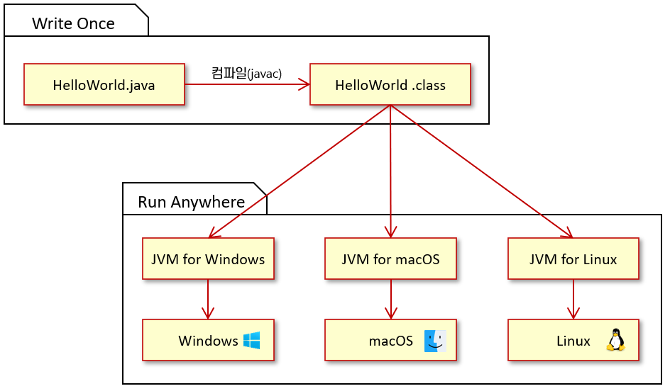

= Write Once Run Anywhere

---

`Write Once Run Anywhere(WORA)` 또는 `Write Once, Run Everywhere(WORE)` Java의 크로스 플랫폼에 의해 얻을 수 있는 이점을 한마디로 표현할 수 있는 표어입니다. 이는 Java가 어떤 장비에서도 개발될 수 있고, 표준 바이트코드로 컴파일되고, Java 가상 머신이 장착된 장비라면 어디에서도 실행될 수 있음을 의미합니다.

Java 프로그래밍 언어로 작성된 소스코드는 Java 컴파일러를 통해 `Java 바이트코드(.class)` 컴파일되며, 바이트코드는 Java 가상 머신 상에서 실행됩니다. 이런 구조가 Write Once Run Anywhere를 가능하도록 만듭니다.

link:./04_java_programming_language.adoc[이전: Java 프로그래밍 언어] +
link:./06_java_virtual_machine.adoc[다음: Java 가상 머신]