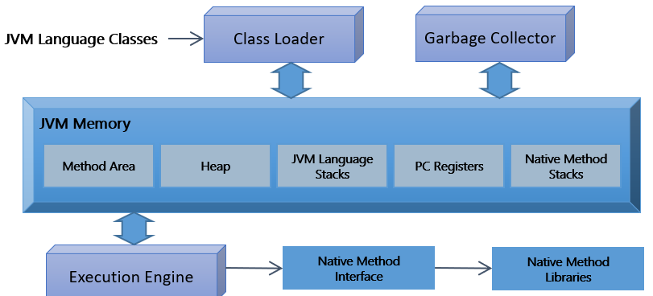

= Java 가상 머신 개요

* Java 바이트코드를 실행할 수 있는 주체
* 인터프리터나 JIT 컴파일 방식으로 다른 컴퓨터에서 바이트코드를 구현할 수 있도록 구현됨
* 플랫폼에 독립적이며 모든 Java 가상 머신은 그 규격에 정의된 대로 Java 바이트코드를 실행
* 표준 Java API까지 동일한 동작으로 구현한 상태에서는 이론적으로 CPU나 운영체제의 종류에 상관없이 동일하게 동작할 것을 보장함

---

`가상 머신(Virtual Machine)` 은 컴퓨팅 환경을 소프트웨어로 구현한 것을 말합니다. 컴퓨터 시스템을 에뮬레이션하는 소프트웨어는 모두 가상 머신으로 불릴 수 있습니다. 시스템상에서 운영체제를 설치하고 실행하거나 또는 단일 응용 프로그램을 실행할 수 있도록 만들어진 소프트웨어를 가상 머신이라고 합니다.

가상 머신은 하드웨어를 가상화 하는 `시스템 가상 머신(System Virtual Machine)` – 대표적으로 하이퍼바이저(Hypervisor) - 과 응용 프로그램을 가상화 하는 `프로세스 가상 머신(Process Virtual Machine)으로` 나눌 수 있으며, Java 가상 머신은 프로세스 가상 머신에 해당합니다.

프로세스 가상 머신(응용 프로그램 가상 머신이라고도 불립니다)은 운영체제 안에서 일반 응용 프로그램을 구동하고 단일 프로세스를 지원합니다. 프로세스 가상 머신의 주 목적은 작성된 프로그램이 모든 플랫폼에서 동일한 방식으로 실행되는 것을 허용하고 실행을 위한 하드웨어나 운영체제의 부분을 가져오는 독립적인 프로그래밍 환경을 제공하는 것입니다. 

Java 가상 머신은 `Java 바이트코드` 를 실행하는 가상 머신이며, 여러 형태가 있으나 인터프리터나 JIT 컴파일 방식으로 다른 컴퓨터에서 바이트코드를 실행할 수 있도록 구현됩니다. 이러한 방식으로 구현된 가상 머신은 `중간 언어(IL – Intermediate Language)`를 실행하는 Microsoft의 CLR(Common Language Runtime)이 있습니다.

Java 가상 머신은 응용 프로그램 개발을 단순화하며, 보안을 강제하고 강화된 환경에서 응용 프로그램을 수행하고, 여러 언어로 만들어진 프로그램이 동작하도록 만들며 응용 프로그램의 배포와 관리를 쉽게 합니다. 또한 이 환경은 가비지 컬렉션과 같은 일반적인 서비스를 포함하여 관리되는 환경을 제공합니다.

[cols="1, 2" options=header]
|===
|구성요소 | 설명
|Class Loader	|Java 컴파일러 소스를 컴파일해서 만들어 낸 바이트코드 클래스들을 엮어 Runtime Data Area 형태로 메모리에 적재하고 메타데이터를 관리합니다.
|Execution Engine	|메모리에 적재된 클래스들을 기계어로 번역하여 명령어 단위로 실행합니다.
|Garbage Collector	|객체의 생명주기를 관리합니다. Heap 메모리 영역에 생성된 객체들 중 유효한 참조가 없는 객체(unreachable)를 자동으로 탐색하고 제거합니다.
|Method Area	|클래스 멤버 변수, 메소드 정보, 타입 정보, 상수 풀, 정적 변수 등이 생성되는 영역입니다.
|Heap Area	|동적으로 생성된 객체와 배열이 저장되는 Garbage Collector의 대상이 되는 영역입니다.
|JVM Language Stacks	|지역 변수, 파라미터 등이 생성되는 영역입니다. 
|PC Register	|현재 쓰레드가 실행되는 부분의 주소와 명령을 저장합니다.
|Native Method Stack	|자바 외의 언어로 작성된 Native 코드를 위한 메모리 영역입니다.
|===

link:./06_java_virtual_machine.adoc[이전: Java 가상 머신] +
link:./08_java_operation_principle.adoc[다음: Java 동작 원리]