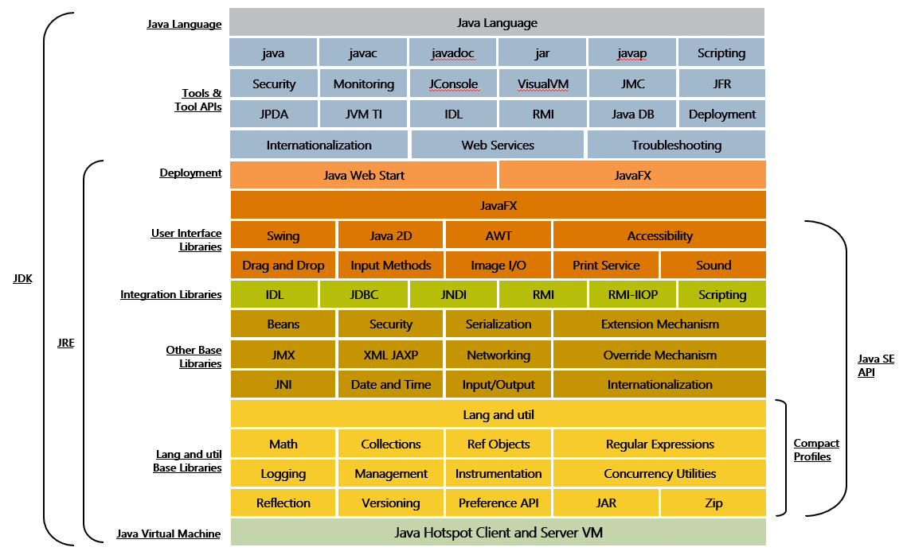

= JDK와 JRE

* JRE (Java Runtime Environment)
** Java 가상 머신, Java 클래스 라이브러리, Java 명령 및 기타 인프라를 포함한 컴파일된 Java 프로그램을 실행하는데 필요한 패키지
** Java 실행 환경이며, 기본적으로 Java 관련 파일이 있는 디렉터리 집합
***  bin/ : Java 실행 프로그램(java 또는 javaw)과 keytool등의 유틸리티를 포함
***  conf/ : 사용자가 편집할 수 있는 구성 파일을 포함
***  lib/ : 모듈, jar 구성 파일, 속성 파일 등 Java 프로그램이 구동되는데 필요한 라이브러리를 포함
* JDK (Java Development Kit)
** Java를 사용하기 위해 필요한 모든 기능을 갖춘 Java용 SDK(Software Development Kit)
** JRE를 포함하며, 컴파일러(javac)와 jdb, javadoc과 같은 도구를 포함
** JRE와 마찬가지로 디렉터리 집합
*** bin/  컴파일러(javac)를 비롯한 개발도구를 포함
*** jmods/  표준 라이브러리용 JMOD 파일을 포함

---

JRE(Java Runtime Library)는 클래스 라이브러리(Class Library)와 Java 응용 프로그램의 실행에 필요한 여러 리소스를 제공하는 소프트웨어 계층입니다. JRE는 작성된 Java 코드를 Java 가상 머신에서 실행하는데 필요한 라이브러리와 결합한 후 Java 가상 머신을 만들어 실행합니다.

JRE는 운영체제를 기반으로 실행되며 Java에 고유한 추가 리소스를 제공합니다. JRE는 운영체제를 추상화하며 Java 응용 프로그램을 실행하고 배포하는 일관된 플랫폼을 제공합니다. JRE 런타임 아키텍처의 주요 구성요소는 아래와 같습니다.

* 클래스 로더 +
Java 응용 프로그램의 실행에 필요한 모든 클래스를 동적으로 로드합니다. Java 클래스는 필요할 때에만 메모리에 로드되는데, JRE는 클래스 로더를 사용하여 요청시에 이 프로세스를 자동화합니다.
* 바이트코드 검증기 +
바이트코드 검증기는 인터프리터에 전달되기 전에 Java 코드의 형식과 정확성을 보장합니다. 코드가 시스템 무결성 또는 액세스 권한을 위반하는 경우 클래스를 로드하지 않습니다.
* 인터프리터 +
바이트코드의 로드에 성공한 후, Java 인터프리터는 Java 응용 프로그램이 기본 시스템에서 기본적으로 실행될 수 있도록 Java 가상 머신의 인스턴스를 생성합니다.

== JRE의 동작
JRE는 Java 가상 머신 외에도 다양한 지원 소프트웨어 도구와 기능들로 구성되어 있습니다.

JRE는 운영체제를 기반으로 실행되며 Java에 고유한 추가 리소스를 제공합니다. JRE는 운영체제를 추상화하며 Java 응용 프로그램을 실행하고 배포하는 일관된 플랫폼을 제공합니다. JRE 런타임 아키텍처의 주요 구성요소는 아래와 같습니다.

* 배포 솔루션 +
응용 프로그램의 활성화를 간소화하고 Java 업데이트를 위한 고급 지원을 제공하는 Java 플러그인 및 Java Web Start등과 같은 배포 기술들이 포함됩니다.
* 사용자 인터페이스 라이브러리 +
JRE는 사용자 인터페이스 개발을 위한 툴킷을 포함합니다. 
** Java 2D +
Java 언어의 2차원 그래픽 작성에 사용되는 API로, 사용자 인터페이스, 애니메이션 등을 작성할 수 있음.
** AWT(Abstract Window Toolkit) +
객체, 버튼, 스크롤바 등 윈도우 작성에 사용되는 GUI(Graphic User Interface)
** Swing +
풍부한 위젯을 사용하여 유연하고 사용자 친화적인 커스터마이징을 제공하는 경량 GUI
* 통합 라이브러리 +
응용 프로그램과 서비스 간에 데이터 연결을 제공하는 라이브러리입니다.
** IDL (CORBA) +
공통 객체 요청 아키텍처를 사용하여 Java 프로그래밍 언어로 작성된 분산 객체
** JDBC (Java Database Connectivity) +
관계형 데이터베이스, 플랫 파일 및 스프레드시트에 대한 액세스를 제공
** JNDI (Java Naming and Directory Interface) +
이름 지정 규칙을 사용하여 데이터베이스 정보를 패치할 수 있는 프로그래밍 인터페이스 및 디렉터리 서비스
* 언어 및 유틸리티 라이브러리 +
응용 프로그램 작성을 위한 언어 지원과 다양한 라이브러리를 지원합니다.
** Collections +
데이터의 저장과 처리를 개선하도록 설계된 자료구조, 인터페이스
** Concurrency Utilities +
고성능 스레딩 유틸리티 프레임워크
** Preference API +
동일 시스템에서 다수의 사용자가 응용 프로그램 환경 설정 그룹을 지정할 수 있는 API
** Logging +
추가 분석을 통해 로그 보고서를 생성
** JAR (Java Archive) +
다수의 파일을 JAR 형식으로 번들링 할 수 있게 하여 다운로드 속도를 개선하고 파일 크기를 줄일 수 있도록 하는 플랫폼 독립형 파일 형식

link:./08_java_operation_principle.adoc[이전: 동작 원리] +
link:./10_jvm_language.adoc[다음: JVM 언어]