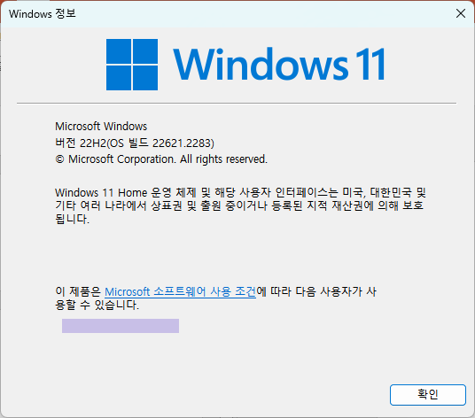

= Lab 1-1: Java 실행 환경 구성

여기에서는 컴퓨터에 Java 실행 환경으로 Adoptium의 Temurin 11을 설치하고 테스트합니다. 아래 절차에 따릅니다.

== Windows에서 Temirin JDK 11 설치

=== Windows 버전 확인
1. Windows 패키지 관리자(winget.exe)를 사용하기 위해서는 Windows 11(10) 22h2 이상이 설치되어 있어야 합니다. 아래 명령으로 사용중인 Windows의 버전을 확인할 수 있습니다.
+
----
> winver
----
+ 

+
2. winget이 동작하지 않는 경우, 아래 웹 사이트를 참조하십시오.
+
https://learn.microsoft.com/ko-kr/windows/package-manager/winget/#install-winget[winget 도구를 사용하여 애플리케이션 설치 및 관리]

=== 컴퓨터에 설치된 Java 확인

1.  **명령 프롬프트**를 실행합니다.
2. 다음 명령을 실행하여 컴퓨터에 설치된 JDK가 있는지 확인합니다.
+
----
> winget list --name JDK
----
+
3. Java가 설치되어 있어 아래와 같이 설치된 Java의 버전이 표시된다면, 아래 절차를 수행하여 설치된 JDK를 삭제합니다.
+
----
이름                                                      장치 ID                        버전        사용 가능 원본
---------------------------------------------------------------------------------------------------------------------
Eclipse Temurin JDK with Hotspot 11.0.20.1+1 (x64)        EclipseAdoptium.Temurin.11.JDK 11.0.20.101 11.0.21.9 winget
Microsoft Build of OpenJDK with Hotspot 11.0.16.1+1 (x64) Microsoft.OpenJDK.11           11.0.16.101 11.0.22.7 winget
----
+
.. 아래 명령을 수행하여 설치된 JDK 버전을 삭제합니다.
+
----
> winget uninstall --id <장치 ID> 
----
+
예제) 아래 명령은 Temurin 11 버전을 삭제합니다.
+
----
> winget uninstall --id EclipseAdoptium.Temurin.11.JDK
----
+
4. 다음 명령을 실행하여 컴퓨터에 Java가 설치되어 있는지 확인합니다.
+
----
> java -version
'java'운(는) 내부 또는 외부 명령, 실행할 수 있는 프로그램 또는 배치 파일이 아닙니다.
----

=== JDK 설치

1. 명령 프롬프트를 실행하고 아래 명령을 실행하여 설치 가능한 Temurin JDK를 확인합니다.
+
----
> winget search Temurin
이름                                장치 ID                        버전       일치         원본
-------------------------------------------------------------------------------------------------
Update Watcher for AdoptOpenJDK     tushev.org.AJUpdateWatcher     2.0.5.0    Tag: temurin winget
Eclipse Temurin JRE with Hotspot 8  EclipseAdoptium.Temurin.8.JRE  8.0.392.8  Tag: temurin winget
Eclipse Temurin JDK with Hotspot 8  EclipseAdoptium.Temurin.8.JDK  8.0.392.8  Tag: temurin winget
Eclipse Temurin JRE with Hotspot    EclipseAdoptium.Temurin.21.JRE 21.0.1.12  Tag: temurin winget
Eclipse Temurin JDK with Hotspot    EclipseAdoptium.Temurin.21.JDK 21.0.1.12  Tag: temurin winget
Eclipse Temurin JRE with Hotspot 20 EclipseAdoptium.Temurin.20.JRE 20.0.1.9   Tag: temurin winget
Eclipse Temurin JDK with Hotspot 20 EclipseAdoptium.Temurin.20.JDK 20.0.2.9   Tag: temurin winget
Eclipse Temurin JRE with Hotspot 19 EclipseAdoptium.Temurin.19.JRE 19.0.2.7   Tag: temurin winget
Eclipse Temurin JDK with Hotspot 19 EclipseAdoptium.Temurin.19.JDK 19.0.2.7   Tag: temurin winget
Eclipse Temurin JRE with Hotspot 18 EclipseAdoptium.Temurin.18.JRE 18.0.2.101 Tag: temurin winget
Eclipse Temurin JDK with Hotspot 18 EclipseAdoptium.Temurin.18.JDK 18.0.2.101 Tag: temurin winget
Eclipse Temurin JRE with Hotspot 17 EclipseAdoptium.Temurin.17.JRE 17.0.9.9   Tag: temurin winget
Eclipse Temurin JDK with Hotspot 17 EclipseAdoptium.Temurin.17.JDK 17.0.9.9   Tag: temurin winget
Eclipse Temurin JDK with Hotspot 16 EclipseAdoptium.Temurin.16.JDK 16.0.2.7   Tag: temurin winget
Eclipse Temurin JRE with Hotspot 11 EclipseAdoptium.Temurin.11.JRE 11.0.21.9  Tag: temurin winget
Eclipse Temurin JDK with Hotspot 11 EclipseAdoptium.Temurin.11.JDK 11.0.21.9  Tag: temurin winget
----
+
2. 아래 명령을 실행하여 Temurin 21 JDK를 설치합니다.
+
----
> winget install -e EclipseAdoptium.Temurin.21.JDK

찾음 Eclipse Temurin JDK with Hotspot 21 [EclipseAdoptium.Temurin.21.JDK] 버전 21.0.20.101
이 응용 프로그램의 라이선스는 그 소유자가 사용자에게 부여했습니다.
Microsoft는 타사 패키지에 대한 책임을 지지 않고 라이선스를 부여하지도 않습니다.
다운로드 중 https://github.com/adoptium/temurin11-binaries/releases/download/jdk-11.0.20.1+1/OpenJDK11U-jdk_x64_windows_hotspot_21.0.20.1_1.msi
  ██████████████████████████████   166 MB /  166 MB
설치 관리자 해시를 확인했습니다.
패키지 설치를 시작하는 중...
설치 성공
----
+
3. 명령 프롬프트를 종료합니다.

=== 설치 확인

1. 명령 프롬프트를 다시 실행하고, 에서 아래 명령을 실행하여 설치된 Temurin JDK를 확인합니다.
+
----
> java -version
openjdk version "21.0.1" 2023-10-17 LTS
OpenJDK Runtime Environment Temurin-21.0.1+12 (build 21.0.1+12-LTS)
OpenJDK 64-Bit Server VM Temurin-21.0.1+12 (build 21.0.1+12-LTS, mixed mode, sharing)
----
+
2. 아래 명령을 실행하여 설치된 Java 컴파일러를 확인합니다.
+
----
>javac -version
javac 21.0.1
----

== macOS에서 Temurin JDK 설치

여기에서는 macOS에서 Java 프로그래밍 환경을 구축합니다. 아래 절차에 따릅니다.

=== homebrew 설치 확인

1. **터미널**을 실행합니다.
2. 터미널에서 아래 명령을 실행하여 macOS 패키지 관리자인 homebrew가 설치되어 있는지 확인합니다.
+
----
brew -v
----
+
3. homebrew가 설치되어 있지 않으면 아래 명령을 실행하여 homebrew를 설치합니다.
+
% /bin/bash -c "$(curl -fsSL https://raw.githubusercontent.com/Homebrew/install/HEAD/install.sh)"
+
> **참고**위 명령이 동작하지 않으면 https://brew.sh/index_ko 에 방문하여 설치 스크립트를 얻어 실행합니다.
+
4. 아래 명령을 실행하여 homebrew를 업데이트 합니다.
+
----
% brew update
----

=== 컴퓨터에 설치된 Java 확인

1. 터미널을 실행합니다.
2. 아래 명령을 실행하여 Java가 설치되어 있는지 확인합니다.
+
----
% java --version
----
+
3. Java가 설치되어 있어 아래와 같이 Java 버전이 표시된다면, 설치된 Java 버전을 확인합니다.
+
----
% java --version
openjdk 11.0.15 2022-04-19
OpenJDK Runtime Environment Temurin-11.0.15+10 (build 11.0.15+10)
OpenJDK 64-Bit Server VM Temurin-11.0.15+10 (build 11.0.15+10, mixed mode)
----

=== Temurin JDK 설치

1. 아래 명령을 실행하여 최신 버전의 Temurin Java 버전을 설치합니다.
+
----
% brew install --cask temurin
----
+
2. 터미널을 종료합니다.

=== 설치 확인

1. 터미널을 다시 실행하고, 아래 명령을 실행하여 설치된 Temurin을 확인합니다.
+
----
% ls -l /Library/Java/JavaVirtualMachines/
----
+
2. 아래 명령을 실행하여 설치된 Java 버전을 확인합니다.
+
----
% java --version
openjdk 21.0.2 2024-01-16 LTS
OpenJDK Runtime Environment Temurin-21.0.2+13 (build 21.0.2+13-LTS)
OpenJDK 64-Bit Server VM Temurin-21.0.2+13 (build 21.0.2+13-LTS, mixed mode)
----
+
3. 아래 명령을 실행하여 설정된 JAVA_HOME 환경 변수를 확인합니다.
+
----
% echo $JAVA_HOME
/Library/Java/JavaVirtualMachines/temurin-21.jdk/Contents/Home
----

link:./13_jdk_provider.adoc[이전: JDK 공급자] +
link:./15_lab1-2.adoc[다음: Lab 1-2 개발 환경 설치]