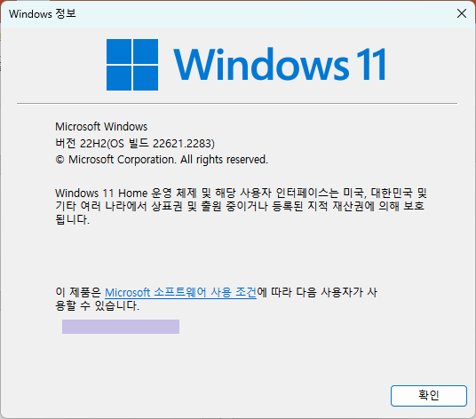

= Lab 1-1: Java 실행 환경 구성

== 연습 1: JDK(Java Development Kit) 설치

여기에서는 컴퓨터에 Java 실행 환경으로 Adoptium의 Temurin 11을 설치하고 테스트합니다. 아래 절차에 따릅니다.

=== Windows에서 Temirin JDK 11 설치

. Windows 버전 확인
.. Windows 패키지 관리자(winget.exe)를 사용하기 위해서는 Windows 11(10) 22h2 이상이 설치되어 있어야 합니다. 아래 명령으로 사용중인 Windows의 버전을 확인할 수 있습니다.
+
----
> winver
----
+ 

+
.. winget이 동작하지 않는 경우, 아래 웹 사이트를 참조하십시오.
+
https://learn.microsoft.com/ko-kr/windows/package-manager/winget/#install-winget[winget 도구를 사용하여 애플리케이션 설치 및 관리]

. 컴퓨터에 설치된 Java 확인
..  **명령 프롬프트**를 실행합니다.
.. 다음 명령을 실행하여 컴퓨터에 Java가 설치되어 있는지 확인합니다.
+
----
> java -version
----
+

+
Java가 설치되어 있어 설치된 Java의 버전이 표시된다면, 제어판에서 설치된 Java를 삭제하고 JAVA_HOME, CLASSPATH 환경 변수와 Java 항목을 삭제합니다.
+
. Temurin 11 설치
.. 명령 프롬프트를 실행하고 아래 명령을 실행하여 Temurin 11 JDK를 확인합니다.
+
----
> winget search Temurin
이름                                장치 ID                        버전        일치         원본
--------------------------------------------------------------------------------------------------
Update Watcher for AdoptOpenJDK     tushev.org.AJUpdateWatcher     2.0.4.0     Tag: temurin winget
Eclipse Temurin JRE with Hotspot 8  EclipseAdoptium.Temurin.8.JRE  8.0.382.5   Tag: temurin winget
Eclipse Temurin JDK with Hotspot 8  EclipseAdoptium.Temurin.8.JDK  8.0.382.5   Tag: temurin winget
Eclipse Temurin JRE with Hotspot 20 EclipseAdoptium.Temurin.20.JRE 20.0.1.9    Tag: temurin winget
Eclipse Temurin JDK with Hotspot 20 EclipseAdoptium.Temurin.20.JDK 20.0.2.9    Tag: temurin winget
Eclipse Temurin JRE with Hotspot 19 EclipseAdoptium.Temurin.19.JRE 19.0.2.7    Tag: temurin winget
Eclipse Temurin JDK with Hotspot 19 EclipseAdoptium.Temurin.19.JDK 19.0.2.7    Tag: temurin winget
Eclipse Temurin JRE with Hotspot 18 EclipseAdoptium.Temurin.18.JRE 18.0.2.101  Tag: temurin winget
Eclipse Temurin JDK with Hotspot 18 EclipseAdoptium.Temurin.18.JDK 18.0.2.101  Tag: temurin winget
Eclipse Temurin JRE with Hotspot 17 EclipseAdoptium.Temurin.17.JRE 17.0.8.101  Tag: temurin winget
Eclipse Temurin JDK with Hotspot 17 EclipseAdoptium.Temurin.17.JDK 17.0.8.101  Tag: temurin winget
Eclipse Temurin JDK with Hotspot 16 EclipseAdoptium.Temurin.16.JDK 16.0.2.7    Tag: temurin winget
Eclipse Temurin JRE with Hotspot 11 EclipseAdoptium.Temurin.11.JRE 11.0.20.101 Tag: temurin winget
Eclipse Temurin JDK with Hotspot 11 EclipseAdoptium.Temurin.11.JDK 11.0.20.101 Tag: temurin winget
----
+
.. 아래 명령을 실행하여 Temurin 11 JDK를 설치합니다.
+
----
> winget install -e EclipseAdoptium.Temurin.11.JDK

찾음 Eclipse Temurin JDK with Hotspot 11 [EclipseAdoptium.Temurin.11.JDK] 버전 11.0.20.101
이 응용 프로그램의 라이선스는 그 소유자가 사용자에게 부여했습니다.
Microsoft는 타사 패키지에 대한 책임을 지지 않고 라이선스를 부여하지도 않습니다.
다운로드 중 https://github.com/adoptium/temurin11-binaries/releases/download/jdk-11.0.20.1+1/OpenJDK11U-jdk_x64_windows_hotspot_11.0.20.1_1.msi
  ██████████████████████████████   166 MB /  166 MB
설치 관리자 해시를 확인했습니다.
패키지 설치를 시작하는 중...
설치 성공
----
+
. 설치 확인
.. 명령 프롬프트에서 아래 명령을 실행하여 설치된 Temurin JDK를 확인합니다.
+
----
> java -version
openjdk version "11.0.20.1" 2023-08-24
OpenJDK Runtime Environment Temurin-11.0.20.1+1 (build 11.0.20.1+1)
OpenJDK 64-Bit Server VM Temurin-11.0.20.1+1 (build 11.0.20.1+1, mixed mode)
----

== macOS에서 Temurin 11 JDK 설치

