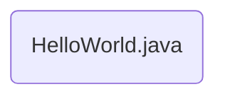

# Module 01: Java 개요
이 장에서는 Java 소프트웨어 플랫폼의 개요로 시작하여 Java 프로그래밍 언어, 실행 환경과 Java 가상 머신(JVM)을 소개하고 Java의 디자인 목표와 언어 지원에 대해 설명합니다. Java의 역사와 여러 JDK 공급자, 다양한 Java 환경에 대해 설명하며, Java 프로그래밍 환경을 구성하는 방법에 대해 실습합니다.

이 장을 마치면, 다음과 같은 것을 할 수 있습니다.
* Java 소프트웨어 플랫폼을 설명할 수 있습니다.
* Java 소프트웨어 플랫폼을 구성하는 요소들에 대해 알게 됩니다.
* Java 실행 환경, 개발 환경을 구분하고 각 환경을 구성하는 구성 요소들에 대해 알게 됩니다.
* Java 계열 프로그래밍 언어와 각 실행 환경에 대해 설명할 수 있습니다.
* Java 프로그래밍 환경과 실행 환경을 구성할 수 있습니다.

### 목차
1. Java 소프트웨어 플랫폼 소개
2. Java 가상 머신
3. Java의 역사
4. Lab 1-1: Java 실행 환경 구성
5. Lab 1-2: 개발 도구 구성

## Java 소프트웨어 플랫폼 소개
Java는 단순히 프로그래밍 언어의 이름으로 사용되는 경우가 많지만, 보다 넓은 의미로 Java 프로그래밍 언어로 작성된 프로그램을 개발하고 실행할 수 있는 플랫폼의 총칭으로 사용됩니다. 이 장에서는 Java 소프트웨어 플랫폼에 대해 알아봅니다.

#### Table of Contents
1. Java 소프트웨어 플랫폼
2. Java 프로그래밍 언어 소개
3. Write Once Run Anywhere

### Java 소프트웨어 플랫폼
---------------
* Java 언어로 기술된 프로그램을 개발하고 실행할 수 있는 소프트웨어 모임의 총칭
* Java 프로그램의 실행 환경과 개발 환경을 제공
    * Java 프로그램은 운영체제와 하드웨어에 의존하지 않는 바이트코드(중간 언어)인 추상적인 코드로 구현
    * Java 프로그램은 운영체제와 하드웨어에 맞게 개발된 Java 가상 머신(JVM) 상에서 실행
    * JVM, 표준 라이브러리 세트, 컴파일러 환경만 맞추면 모든 환경에서 동일하게 동작
* Java 언어 Java Language, Java 애플리케이션Java Application, JREJava Runtime Environment, Java 가상 머신Java Virtual Machine, 모바일용 JavaJava Micro Edition등과 함께 단순히 Java라 불리는 경우가 많음
------------------

Java는 단순히 프로그래밍 언어의 이름으로 사용되는 경우가 많지만, 보다 넓은 의미로 Java 프로그래밍 언어로 작성된 프로그램을 개발하고 실행할 수 있는 플랫폼의 총칭으로도 사용됩니다.

##### 바이트코드(Byte Code)  
바이트코드는 특정 하드웨어가 아닌 가상 컴퓨터(Virtual Machine)에서 동작하는 실행 프로그램을 위한 이진 표현법입니다. 가상 머신은 이 바이트 코드를 각각의 하드웨어 아키텍처에 맞는 기계어로 변환하여 실행합니다.   
Java에서 바이트코드는 Java 가상 머신이 이해할 수 있는 언어로 개발된 Java 소스 코드를 의미하며, Java 바이트코드는 .class 확장자를 가지는 파일입니다. Java 바이트코드는 Java 가상 머신만 있으면 어떤 운영체제 에서라도 실행될 수 있습니다.
##### Java 가상 머신(Java Virtual Machine)
가상 머신이란 물리적으로 존재하는 컴퓨터가 아닌, 다른 컴퓨터가 만들어내는 가상의 컴퓨터를 의미합니다.   
가상 머신은 크게 프로세스 가상 머신과 시스템 가상 머신으로 나눌 수 있습니다. 응용 프로그램 가상 머신이라고도 불리는 프로세스 가상 머신은 하나의 프로세스만을 위해 생성되고 그 프로세스가 끝나면 종료됩니다. 프로세스 가상 머신은 일반적으로 다양한 플랫폼에서 같은 프로그램을 동일한 방식으로 동작시키기 위해 사용됩니다.  
Java 가상 머신은 대표적인 프로세스 가상 머신이며, Java로 작성된 프로그램은 아래와 같은 형태로 실행됩니다.

