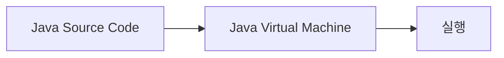

# Module 01: Java 개요
이 장에서는 Java 소프트웨어 플랫폼의 개요로 시작하여 Java 프로그래밍 언어, 실행 환경과 Java 가상 머신(JVM)을 소개하고 Java의 디자인 목표와 언어 지원에 대해 설명합니다. Java의 역사와 여러 JDK 공급자, 다양한 Java 환경에 대해 설명하며, Java 프로그래밍 환경을 구성하는 방법에 대해 실습합니다.

이 장을 마치면, 다음과 같은 것을 할 수 있습니다.
* Java 소프트웨어 플랫폼을 설명할 수 있습니다.
* Java 소프트웨어 플랫폼을 구성하는 요소들에 대해 알게 됩니다.
* Java 실행 환경, 개발 환경을 구분하고 각 환경을 구성하는 구성 요소들에 대해 알게 됩니다.
* Java 계열 프로그래밍 언어와 각 실행 환경에 대해 설명할 수 있습니다.
* Java 프로그래밍 환경과 실행 환경을 구성할 수 있습니다.

### 목차
1. Java 소프트웨어 플랫폼 소개
2. Java 가상 머신
3. Java의 역사
4. Lab 1-1: Java 실행 환경 구성
5. Lab 1-2: 개발 도구 구성

 
 
 
 
 

## Java 소프트웨어 플랫폼 소개
Java는 단순히 프로그래밍 언어의 이름으로 사용되는 경우가 많지만, 보다 넓은 의미로 Java 프로그래밍 언어로 작성된 프로그램을 개발하고 실행할 수 있는 플랫폼의 총칭으로 사용됩니다. 이 장에서는 Java 소프트웨어 플랫폼에 대해 알아봅니다.

#### Table of Contents
1. Java 소프트웨어 플랫폼
2. Java 프로그래밍 언어 소개
3. Write Once Run Anywhere

 

### Java 소프트웨어 플랫폼
---------------
* Java 언어로 기술된 프로그램을 개발하고 실행할 수 있는 소프트웨어 모임의 총칭
* Java 프로그램의 실행 환경과 개발 환경을 제공
    * Java 프로그램은 운영체제와 하드웨어에 의존하지 않는 바이트코드(중간 언어)인 추상적인 코드로 구현
    * Java 프로그램은 운영체제와 하드웨어에 맞게 개발된 Java 가상 머신(JVM) 상에서 실행
    * JVM, 표준 라이브러리 세트, 컴파일러 환경만 맞추면 모든 환경에서 동일하게 동작
* Java 언어 Java Language, Java 애플리케이션Java Application, JREJava Runtime Environment, Java 가상 머신Java Virtual Machine, 모바일용 JavaJava Micro Edition등과 함께 단순히 Java라 불리는 경우가 많음
------------------

Java는 단순히 프로그래밍 언어의 이름으로 사용되는 경우가 많지만, 보다 넓은 의미로 Java 프로그래밍 언어로 작성된 프로그램을 개발하고 실행할 수 있는 플랫폼의 총칭으로도 사용됩니다.

##### 바이트코드(Byte Code)  
바이트코드는 특정 하드웨어가 아닌 가상 컴퓨터(Virtual Machine)에서 동작하는 실행 프로그램을 위한 이진 표현법입니다. 가상 머신은 이 바이트 코드를 각각의 하드웨어 아키텍처에 맞는 기계어로 변환하여 실행합니다.   
Java에서 바이트코드는 Java 가상 머신이 이해할 수 있는 언어로 개발된 Java 소스 코드를 의미하며, Java 바이트코드는 .class 확장자를 가지는 파일입니다. Java 바이트코드는 Java 가상 머신만 있으면 어떤 운영체제 에서라도 실행될 수 있습니다.
##### Java 가상 머신(Java Virtual Machine)
가상 머신이란 물리적으로 존재하는 컴퓨터가 아닌, 다른 컴퓨터가 만들어내는 가상의 컴퓨터를 의미합니다.   
가상 머신은 크게 프로세스 가상 머신과 시스템 가상 머신으로 나눌 수 있습니다. 응용 프로그램 가상 머신이라고도 불리는 프로세스 가상 머신은 하나의 프로세스만을 위해 생성되고 그 프로세스가 끝나면 종료됩니다. 프로세스 가상 머신은 일반적으로 다양한 플랫폼에서 같은 프로그램을 동일한 방식으로 동작시키기 위해 사용됩니다.  
Java 가상 머신은 대표적인 프로세스 가상 머신이며, Java로 작성된 프로그램은 아래와 같은 형태로 실행됩니다.

이와 유사한 형태의 가상 머신은 Microsoft의 CLR(Command Language Runtime)등이 있습니다.

#### Java 플랫폼(Java Platfornm)
Java 플랫폼은 Java 프로그래밍 언어로 프로그램을 개발하고 빌드하며 실행하는 일을 할 수 있도록 하는 프로그램들의 모입입니다.
|플랫폼|설명|
|-----|----|
|Java SE(Java Standard Edition)|데스크톱, 서버, 고사양의 임베디드 시스템을 위한 표준 Java 플랫폼으로, 표준적인 컴퓨팅 환경을 지원하기 위한 Java 가상 머신 규격 및 API 집합을 포함합니다. Java SE는 Java 가상 머신 규격 전체를 지원하며 Java 가상 머신 규격의 변경이 필요한 부분은 일반적으로 Java SE에 먼저 제안되고 추후에 Java EE및 Java ME에 포함됩니다|
|Java ME(Java Micro Edition)|제한된 자원을 가진 휴대 전화, PDA, 셋톱 박스 등에서 Java 프로그래밍 언어를 지원하기 위해 만들어진 Java 플랫폼입니다. 각각 다른 특성을 가진 Java ME 플랫폼들이 존재하며 각각의 사용자 인터페이스, 보안, 네트워크 프로토콜 등이 포함됩니다.|
|Jakarta EE|이전의 Java EE(Enterprise Edition)이며, Java를 이용한 서버 개발을 위한 플랫폼입니다. Java EE는 데스크톱 등에서 동작하는 표준 플랫폼인 Java SE에 웹 애플리케이션 서버에서 동작하는 장애 복구 미 분산 아키텍처를 제공하는 기능을 추가한 서버를 위한 플랫폼입니다.|

 

### Java 프로그래밍 언어
* * *
* Sun Microsystems의 제임스 고슬링(James Gosling)이 1995년 개발한 객체지향 언어
* C/C++와는 다르게 처음부터 객체지향 언어로 개발됨
* Java 프로그래밍 언어의 5가지 핵심 목표
    * 객체 지향 방법론을 사용해야 한다.*
    * 같은 프로그램(바이트코드)이 여러 운영체제(마이크로프로세서)에 탑재되어야 한다.
    * 컴퓨터 네트워크 접근 기능이 기본적으로 탑재되어 있어야 한다.
    * 원격 코드를 안전하게 실행할 수 있어야 한다.
    * 다른 객체 지향 언어들의 좋은 부분만 가지고 와서 사용하기 편해야 한다.

* * *
Java는 Sun Microsystems의 제임스 고슬링과 연구원들이 개발해 1995년 발표한 객체 지향 프로그래밍 언어입니다. 처음에는 가전제품 내에 탑재해 동작하는 프로그램을 위해 개발했지만 현재 전체적으로 가장 많이 사용하는 프로그래밍 언어중의 하나가 되었으며 모바일 기기용 응용 프로그램 개발에도 많이 사용됩니다.

Java는 C에서 진화한 C++와는 다르게 초기 설계부터 객체 지향 언어로 설계되었으며, 같은 코드로 어떤 마이크로프로세서에서나 실행되는 것을 목표로 했습니다. 이 결과로 Java 소스코드를 컴파일하면 Java 실행 코드인 바이트코드가 생성되며, 생성된 바이트코드는 Java 가상 머신에 의해 실행됩니다. C/C++ 코드로 작성되어 중간 실행 과정이 없는 네이티브 프로그램보다는 실행속도가 느리지만, 같은 코드로 다양한 플랫폼이나 운영체제에서 실행될 수 있다는 장점이 있습니다.

Java의 개발사인 Sun Microsystems는 자바를 GPL 라이선스로 오픈하였으며, 대부분의 코어 부분을 오픈하였습니다. 2009년 Sun Microsystems가 Oracle과 인수 합병됨에 따라 Java에 대한 권리 및 유지보수는 Oracle이 가지고 있습니다.

 

### Write Once Run Anywhere
* * *
그림
* * *
Write Once Run Anywhere(WORA) 또는 Write Once, Run Everywhere(WORE)는 Java의 크로스 플랫폼에 의해 얻을 수 있는 이점을 한마디로 표현할 수 있는 표어입니다. 이는 Java가 어떤 장비에서도 개발될 수 있고, 표준 바이트코드로 컴파일되고, Java 가상 머신이 장착된 장비라면 어디에서도 실행될 수 있음을 의미합니다.

Java 프로그래밍 언어로 작성된 소스코드는 Java 컴파일러를 통해 Java 바이트코드(.class)로 컴파일되며, 바이트코드는 Java 가상 머신 상에서 실행됩니다. 이런 구조가 Write Once Run Anywhere를 가능하도록 만듭니다.

 
 
 
 
 

## Java 가상 머신
Java 가상 머신은 Java 바이트코드를 실행하는 실행하는 가상 머신이며, 인터프리터나 JIT 컴파일 방식으로 다른 컴퓨터에서 바이트코드를 실행하도록 구현된 Java의 실행 환경이자 개발 환경입니다. 이 장에서는 Java 가상 머신에 대해 알아봅니다.

#### Table of Contents
1. Java 가상 머신
2. Java 동작 원리
3. JDK와 JRE
4. JVM 언어

 

### Java 가상 머신
* * *
* Java 바이트코드를 실행할 수 있는 주체
* 인터프리터나 JIT 컴파일 방식으로 다른 컴퓨터에서 바이트코드를 구현할 수 있도록 구현됨
* 플랫폼에 독립적이며 모든 Java 가상 머신은 그 규격에 정의된 대로 Java 바이트코드를 실행
* 표준 Java API까지 동일한 동작으로 구현한 상태에서는 이론적으로 CPU나 운영체제의 종류에 상관없이 동일하게 동작할 것을 보장함
* * *

가상 머신(Virtual Machine)은 컴퓨팅 환경을 소프트웨어로 구현한 것을 말합니다. 컴퓨터 시스템을 에뮬레이션하는 소프트웨어는 모두 가상 머신으로 불릴 수 있습니다. 시스템상에서 운영체제를 설치하고 실행하거나 또는 단일 응용 프로그램을 실행할 수 있도록 만들어진 소프트웨어를 가상 머신이라고 합니다.

가상 머신은 하드웨어를 가상화 하는 시스템 가상 머신(System Virtual Machine) – 대표적으로 하이퍼바이저(Hypervisor)과 응용 프로그램을 가상화 하는 프로세스 가상 머신(Process Virtual Machine)으로 나눌 수 있으며, Java 가상 머신은 프로세스 가상 머신에 해당합니다.

프로세스 가상 머신(응용 프로그램 가상 머신이라고도 불립니다)은 운영체제 안에서 일반 응용 프로그램을 구동하고 단일 프로세스를 지원합니다. 프로세스 가상 머신의 주 목적은 작성된 프로그램이 모든 플랫폼에서 동일한 방식으로 실행되는 것을 허용하고 실행을 위한 하드웨어나 운영체제의 부분을 가져오는 독립적인 프로그래밍 환경을 제공하는 것입니다. 

Java 가상 머신은 Java 바이트코드를 실행하는 가상 머신이며, 여러 형태가 있으나 인터프리터나 JIT 컴파일 방식으로 다른 컴퓨터에서 바이트코드를 실행할 수 있도록 구현됩니다. 이러한 방식으로 구현된 가상 머신은 중간 언어(IL – Intermediate Language)를 실행하는 Microsoft의 CLR(Common Language Runtime)이 있습니다.

Java 가상 머신은 응용 프로그램 개발을 단순화하며, 보안을 강제하고 강화된 환경에서 응용 프로그램을 수행하고, 여러 언어로 만들어진 프로그램이 동작하도록 만들며 응용 프로그램의 배포와 관리를 쉽게 합니다. 또한 이 환경은 가비지 컬렉션과 같은 일반적인 서비스를 포함하여 관리되는 환경을 제공합니다.

|구성요소|설명|
|-------|----|
|Class Loader|Java 컴파일러 소스를 컴파일해서 만들어 낸 바이트코드 클래스들을 엮어 Runtime Data Area 형태로 메모리에 적재하고 메타데이터를 관리합니다.|
|Execution Engine|메모리에 적재된 클래스들을 기계어로 번역하여 명령어 단위로 실행합니다.|
|Gabage Collector|객체의 생명주기를 관리합니다. Heap 메모리 영역에 생성된 객체들 중 유효한 참조가 없는 객체(unreachable)를 자동으로 탐색하고 제거합니다.|
|Method Area|클래스 멤버 변수, 메소드 정보, 타입 정보, 상수 풀, 정적 변수 등이 생성되는 영역입니다.|
|Heap Area|동적으로 생성된 객체와 배열이 저장되는 Garbage Collector의 대상이 되는 영역입니다.|
|JVM Language Stacks|지역 변수, 파라미터 등이 생성되는 영역입니다.|
|PC Register|현재 스레드가 실행되는 부분의 주소와 명령을 저장합니다.|
|Native Method Stack|자바 외의 언어로 작성된 Native 코드를 위한 메모리 영역입니다.|

 

### Java 동작 원리
* * *

* * *
 Java 실행 엔진의 동작 방식은 Java 가상 머신의 구현에 따라 다릅니다. Oracle의 Hotspot의 경우에는 아래와 같이 동작합니다.

* 일반적으로 인터프리터가 프로그램을 시작하는데 사용됩니다.
* Java 가상 머신은 성능 향상을 위해 코드의 성능에 중요한 부분을 컴파일하지만 거의 사용되지 않는 코드는 컴파일하지 않습니다.
* 코드를 컴파일하는 방법을 최적화하기 위해 라인별 adaptive compiler를 사용합니다.

Java 가상 머신은 라인별로 바이트 코드를 읽어 기계어로 변환해 실행하며 기본적으로는 인터프리터를 통해 실행을 하지만 자주 등장하는 바이트 코드일 경우 JIT 컴파일러로 컴파일하는 방법을 통해 실행 방법을 최적화합니다.

#### 인터프리터
바이트 코드를 하나씩 읽어서 해석하고 실행합니다. 한 줄 단위로 읽어서 해석하고 실행하기 때문에 바이트 코드 단위의 해석은 빠른 대신 인터프리팅 결과의 실행은 느리다는 단점을 가집니다. 바이트 코드는 기본적으로 인터프리터 방식으로 동작합니다.

#### JIT(Just-In-Time) 컴파일러
인터프리터의 단점을 보완하기 위해 도입되었으며, 인터프리터 방식으로 동작하다가 적절한 시점에 바이트코드 전체를 컴파일하여 네이티브 코드로 변경하고, 해당 메소드를 더 이상 인터프리팅 하지 않고 네이티브 코드로 직접 실행합니다. 네이티브 코드를 실행하는 것이 인터프리팅보다 빠르고, 네이티브 코드는 캐시에 보관하기 때문에 한 번 컴파일된 코드는 계속 빠르게 실행됩니다.