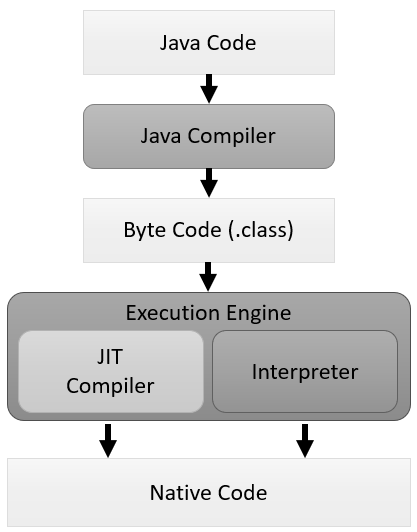

= Java 동작 원리

---

Java 실행 엔진의 동작 방식은 Java 가상 머신의 구현에 따라 다릅니다. Oracle의 Hotspot의 경우에는 아래와 같이 동작합니다.

* 일반적으로 인터프리터가 프로그램을 시작하는데 사용됩니다.
* Java 가상 머신은 성능 향상을 위해 코드의 성능에 중요한 부분을 컴파일하지만 거의 사용되지 않는 코드는 컴파일하지 않습니다.
* 코드를 컴파일하는 방법을 최적화하기 위해 라인별 adaptive compiler를 사용합니다.

Java 가상 머신은 라인별로 바이트 코드를 읽어 기계어로 변환해 실행하며 기본적으로는 인터프리터를 통해 실행을 하지만 자주 등장하는 바이트 코드일 경우 JIT 컴파일러로 컴파일하는 방법을 통해 실행 방법을 최적화합니다.

== 인터프리터
바이트 코드를 하나씩 읽어서 해석하고 실행합니다. 한 줄 단위로 읽어서 해석하고 실행하기 때문에 바이트 코드 단위의 해석은 빠른 대신 인터프리팅 결과의 실행은 느리다는 단점을 가집니다. 바이트 코드는 기본적으로 인터프리터 방식으로 동작합니다.

== JIT(Just-In-Time) 컴파일러
인터프리터의 단점을 보완하기 위해 도입되었으며, 인터프리터 방식으로 동작하다가 적절한 시점에 바이트코드 전체를 컴파일하여 네이티브 코드로 변경하고, 해당 메소드를 더 이상 인터프리팅 하지 않고 네이티브 코드로 직접 실행합니다. 네이티브 코드를 실행하는 것이 인터프리팅보다 빠르고, 네이티브 코드는 캐시에 보관하기 때문에 한 번 컴파일된 코드는 계속 빠르게 실행됩니다.

link:./07_overview_java_virtual_machine.adoc[이전: Java 가상 머신 개요] +
link:./09_jdk_jre.adoc[다음: JDK와 JRE]

