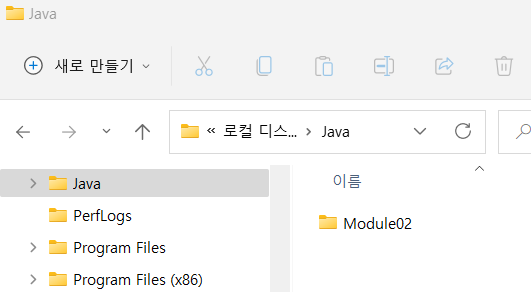
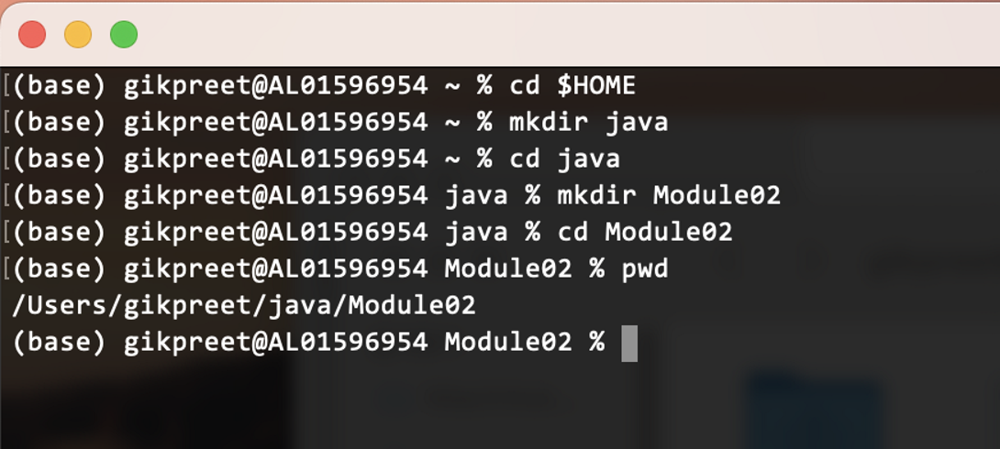
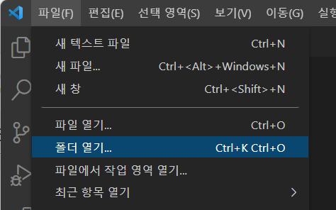
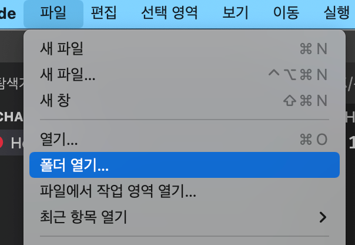
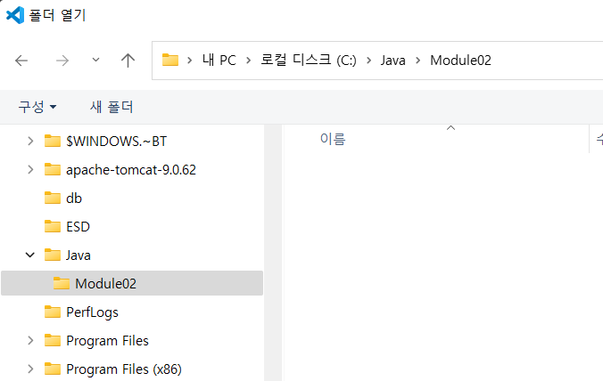
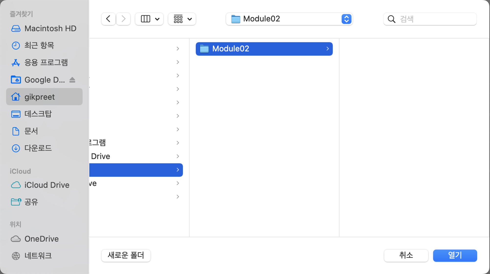
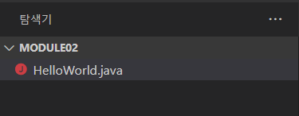
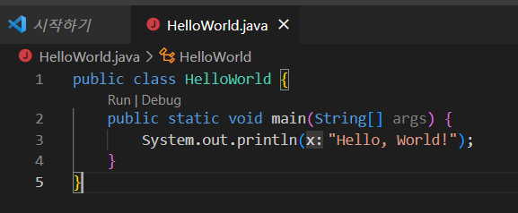
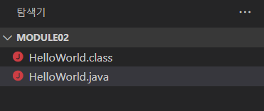

= Demo: Java 프로그램 컴파일 및 실행

여기에서는 간단한 Java 프로그램을 작성하고 컴파일하여 실행하는 데모를 보여줍니다. 이 데모를 위해서는 Lab 1에서 연습하여 설치한 Java 개발/실행 환경 설치가 필요합니다.

1. 운영체제의 적당한 위치에 연습할 Java 코드가 위치할 폴더를 생성합니다. (이 연습에서는 Windows의 경우 c:\java\Module02를, macOS의 경우 $HOME\Java\Module02 폴더를 사용합니다)
+
Windows (ex. c:\java\module02)
+

+ 
macOS (ex: $HOME/java/Module02)
+

+
2.	Visual Studio Code를 실행합니다.
3.	파일 메뉴에서 폴더 열기를 클릭합니다.
+
Windows
+

+
macOS
+

+
4.	Java 소스 파일들이 위치할 폴더를 지정하고 열기 버튼을 클릭합니다.
+
Windows
+

+
macOS
+

+
5.	Visual Studio Code의 왼쪽 메뉴에서 탐색기를 클릭하고 새 파일을 클릭합니다.
+
Windows
+

+
macOS
+

+
6.	생성된 파일의 이름을 HelloWorld.java로 지정합니다.
+
image:./images/image09.png[windows, 500]
+
7.	파일에 아래와 같이 Hello, World! 문자열을 출력하는 Java 코드를 작성합니다.
+
[source, java]
----
public class HelloWorld {
    public static void main(String[] args) {
        System.out.println("Hello, World!");
    }
}
----
8.	작성한 코드를 저장합니다. (코드를 저장하면 편집기의 아이콘이 동그라미에서 x 로 바뀝니다)
+

+
9.	Visual Studio의 메뉴바에서 터미널을 클릭하고 새 터미널을 클릭합니다.
10.	아래 명령을 실행하여 작성한 HelloWorld.java 를 컴파일 합니다.
+
----
> javac HelloWorld.java
----
+
11.	탐색기에서 HelloWorld.class 파일이 생성된 것을 확인합니다.
+

+
12.	아래 명령을 실행하여 컴파일된 HelloWord 프로그램을 실행합니다.
+
----
> java HelloWorld
----

link:./06_java_langa_package.adoc[이전: import 지시문과 java.lang 패키지] +
link:./08_basic_inputout.adoc[다음: 기본적입 입/출력 동작]