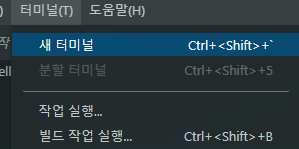
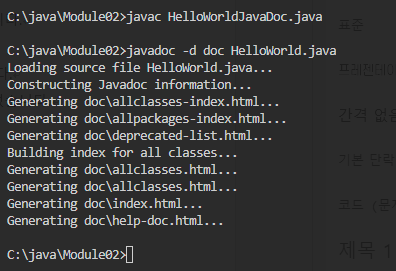
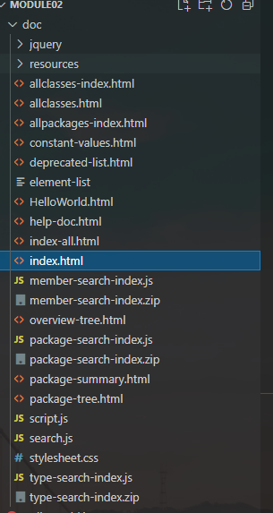
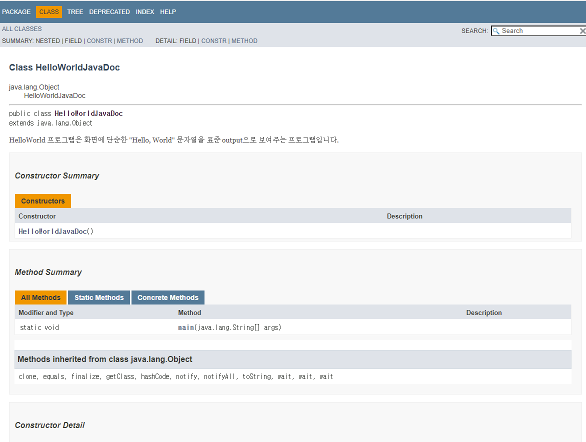

= Demo: JavaDoc을 사용한 HTML 문서 생성

여기에서는 javaDoc을 사용하여 java 소스 파일의 주석을 사용하여 졍돈된 HTML 문서를 생성하는 것을 보여줍니다.

1. 이전 Demo에서 작성했던 HelloWorldJavaDoc.java 파일을 열고 소스를 살펴봅니다.
+
[source, java]
----
/** 
 * HelloWorld 프로그램은 화면에 단순한 "Hello, World" 문자열을
 * 표준 output으로 보여주는 프로그램입니다.
 * 
 * @author 홍길동
 * @version 1.0
 * @since 2022-03-01
 */

 public class HelloWorldJavaDoc {
    /**
     * @param args 프로그램이 실행될 때 주어지는 인자값이 포함된 문자열 배열입니다.
     */
    public static void main(String[] args) {
        System.out.println("Hello, World!");
    }
}
----
+
* 클래스를 설명하는 주석이 포함되어 있습니다.
* 클래스 소스 파일 작성자를 알리기 위한 @author 어노테이션이 포함되었습니다.
* 소스 파일의 버전을 알리기 위한 @version 어노테이션이 포함되었습니다.
* 소스 파일이 릴리스된 일시를 알리기 위한 @Since 어노테이션이 포함되었습니다.
* main 메소드의 args 파라미터를 알리기 위한 @params 어노테이션이 포함되었습니다.
+
2.	Visual Studio Code의 터미널 메뉴에서 새 터미널을 클릭합니다.
+

+
3.	터미널에서 다음 명령을 입력합니다.
+
----
> Javadoc -d doc HelloWorldJavaDoc.java
----
+
**중요** 한글이 포함된 Java 코드는 UTF-8 또는 euc-kr로 인코딩 되어야 합니다. Visual Studio Code의 오른쪽 하단에서 현재 인코딩을 클릭하여 파일의 인코딩을 변경할 수 있습니다.
+

+
4.	Visual Studio Code의 파일 탐색기에서 생성된 doc 폴더를 확인하고 확장합니다.
+

+
5.	index.html 파일을 클릭하여 파일의 내용을 확인합니다.
6.	Windows 탐색기에서 파일을 더블 클릭하여 웹 브라우저에서 파일을 확인합니다.
+

link:./15_exception.adoc[이전: 예외 처리] +
link:./17_compile_run_debug.adoc[다음: 컴파일, 실행, 디버깅]
 
