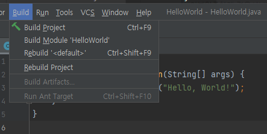

= 컴파일러 호출

* 일반적인 컴파일러 옵션
* 명령 줄에서 컴파일
* 개발 환경에서 컴파일
* 오류 표시

---

Java 응용 프로그램을 실행하기 위해서는 반드시 소스 파일을 컴파일 해야 합니다. 명령 줄이나 개발 환경에서 Java 컴파일러를 호출할 수 있습니다.

== 일반적인 컴파일러 옵션

java 명령을 사용하여 Java 소스 파일을 컴파일 할 수 있으며, 필요한 경우 옵션을 사용할 수 있습니다. 다음은 일반적으로 사용되는 컴파일러 옵션입니다.

[%header, cols="1,2,2", width=90%]
|===
|옵션|	설명|	사용법
|classpath|	컴파일 시 필요로 하는 참조할 클래스 파일의 경로 지정|	$ javac –classpath <참조파일 경로> <source file> +
$ javac –cp <참조파일 경로> <source file>
|d| 	클래스 파일을 생성할 루트 폴더 결정|	$ javac –d <루트 폴더> <source file>
|encoding|	소스 파일에 사용된 인코딩 설정|	$ javac –encoding <인코딩 셋> <source file>
|g| 	디버깅 정보 옵션|	$ javac-g:line, var (지역변수), <source file>
|nowarn|	경고 메시지를 생성하지 않고 컴파일|	$ java –nowarn <source file>
|sourcepath|	소스 파일의 위치 지정|	$ java –sourcepath <소스 경로> <source file>
|===

== 명령 줄에서 컴파일

명령 줄에서 Java 응용 프로그램을 컴파일하려면 javac 명령을 사용합니다. 명령줄에서 Hello, World 응용 프로그램(HelloWorld.java)을 컴파일하고 class 폴더에 바이트코드를 생성하는 명령은 다음과 같습니다.

----
> javac -d class HelloWorld.java
----

== 개발 환경에서 컴파일

Java 응용 프로그램을 개발하기 위해서 IntelliJ, Eclipse등 많은 개발 도구를 사용할 수 있습니다. 대부분의 개발도구에서 Java 응용 프로그램을 컴파일하기 위해서는 프로젝트 단위로 코드 모음을 생성해야 하며, 개발 도구는 빌드 기능과 실행 기능을 제공합니다.

IntelliJ 통합 개발 환경에서는 아래와 같이 프로젝트 단위로 생성된 코드를 컴파일 합니다.

_Build 메뉴에서 Project Build 선택_

 
== 오류 표시

Java 컴파일러가 컴파일 도중 구문 또는 의미 오류를 발생하면 이를 출력합니다. 컴파일러가 명령 줄에서 호출된 경우 오류가 발견된 각 줄의 줄번호와 문자 위치를 나타내는 메시지가 표시됩니다. 대부분의 개발 환경 역시 오류를 포함하는 라인을 보여주며, 개발 환경은 오류를 쉽게 찾고 수정할 수 있는 도구들을 제공합니다.

----
> javac -d class HelloWorld.java
HelloWorld.java:3: error: ';' expected
        System.out.println(args[0])
                                   ^
1 error
----

link:./17_compile_run_debug.adoc[이전: 컴파일, 실행, 디버깅] +
link:./19_run_java_program.adoc[다음: Java 프로그램 실행]