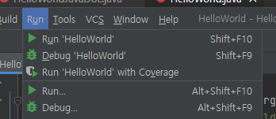

= Java 프로그램 실행

* 명령 줄에서 Java 프로그램 실행
* java 명령어 로 컴파일된 클래스를 호출

----
$ java <class name>
----

* 개발 환경에서 Java 프로그램 실행
* 각 개발 환경의 실행/디버깅 방법에 따름

---

컴파일 된 Java 응용 프로그램은 java 명령을 사용하여 실행할 수 있습니다.

== 명령 줄에서 실행

응용 프로그램이 성공적으로 컴파일 되면, 바이트 코드로 구성된 .class 파일이 생성됩니다. 응용 프로그램에 여러 클래스나 인터페이스가 있으면, 모든 클래스나 인터페이스가 개별 .class 파일로 생성됩니다. 생성된 바이트 코드를 실행하기 위해서는 아래와 같이 java 명령을 호출합니다.

----
> java <.class 파일>
----

== 개발 환경에서 Java 프로그램 실행
Java 응용 프로그램을 개발하는 많은 개발 환경은 환경 내에서 응용 프로그램을 컴파일하고 실행할 수 있는 기능을 제공합니다.

예를 들어, IntelliJ 통합 개발 환경에서는 아래와 같이 프로젝트 단위로 생성된 응용 프로그램을 실행합니다.

link:./18_invoking_compiler.adoc[이전: 컴파일러 호출] +
link:./20_debugging.adoc[다음: 디버깅]
 
