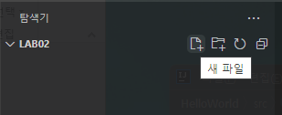
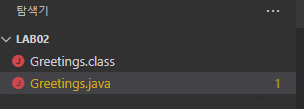
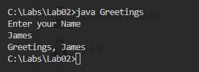

= Lab 2-1 : 간단한 Java 프로그램 작성

이 연습에서는 Visual Studio Code를 사용하여 간단한 Java 프로그램을 작성합니다. 프로그램은 이름을 물어보고 이름과 함께 안녕 메시지를 출력합니다.

== Java 응용 프로그램 생성
1.	Visual Studio Code를 실행합니다.
2.	파일 메뉴에서 폴더 열기를 클릭하고 c:\Labs\Lab02\Starter 폴더를 엽니다.
3.	작성자 신뢰 경고 창에서 예, 작성자를 신뢰합니다 버튼을 클릭합니다.
+
image:./images/image18.png[trust, 500]
+
4.	Visual Studio Code 탐색기에서 새 파일 아이콘을 클릭합니다.
+

+
5.	파일 이름을 Greetings.java로 지정합니다.
6.	Greetings 클래스를 아래와 같이 작성합니다.
+
[source, java]
----
import java.util.Scanner;
	
public class Greetings {
    public static void main(String[] args) {

    }
}
----
+
7.	파일을 저장합니다.

== 사용자의 이름을 입력받아 메시지를 출력하는 코드 작성

1.	main 메소드에 String 타입 변수 myName을 선언합니다.
+
[source, java]
----
String myName;
----
+
2.	사용자의 이름을 입력하라는 메시지를 출력하는 코드를 작성합니다.
3.	키보드 표준 입력을 위한 Scanner 클래스를 생성하고 입력 받은 값을 myName 변수에 할당하는 코드를 작성합니다.
4.	myName 변수에 할당 받은 값을 이용해서 “Greetings, [myName]” 을 출력하는 코드를 작성합니다.
5.	Scanner를 닫습니다.
6.	작성이 완료된 main 메소드 코드는 아래와 유사할 것입니다.
+
[source, java]
----
public static void main(String[] args) {
    String myName;

    System.out.println("Enter your Name");
    Scanner scanner = new Scanner(System.in);
    myName = scanner.next();
    System.out.printf("Greetings, %s", myName);
    scanner.close();
}
----
7.	파일을 저장합니다.

== 프로그램을 컴파일하고 실행
1.	터미널 메뉴에서 새 터미널을 클릭합니다.
2.	터미널이 열리면, 아래 명령을 실행하여 코드를 컴파일 합니다.
+
----
> javac Greetings.java
----
+
3.	오류가 발생하면 수정합니다.
4.	컴파일에 성공하면, 탐색기에서 생성된 Greetings.class 파일을 확인합니다.
+

+
5.	아래 명령을 수행하여 프로그램을 실행합니다.
+
----
> java Greetings
----
+

link:./21_jdk_tools.adoc[이전: JDK 도구] +
link:./23_lab2-2.adoc[다음: Lab 2-2 디버깅]
