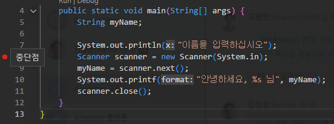
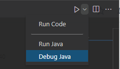
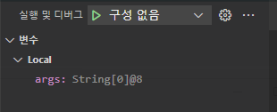
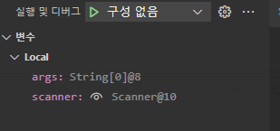
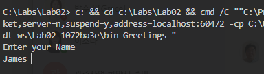
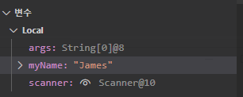
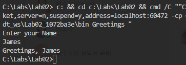

= Lab 2-2: 디버깅

이 연습에서는 Visual Studio Code를 사용하여 프로그램을 한 단계씩 실항하고 변수 값을 검사하여 디버깅 하는 작업을 연습합니다.

== Visual Studio Code에서 Breakpointy를 지정하고 디버깅 시작
1.	Visual Studio Code 에디터에 열려 있는 Greetings 클래스의 main 메소드에서, scanner를 생성하는 코드의 라인 번호 옆을 클릭하여 Breakpoint를 지정합니다.
+

+ 
2.	오른쪽 위, 화살표 옆의 ∨ 기호를 클릭하고 Debug Java를 클릭합니다.
+

+
3.	왼쪽의 실행 및 디버그 창에서, 변수를 확인합니다.
+

+
4.	F10키를 눌러 다음 단계를 실행하고 실행 및 디버그 창에서, 변수를 확인합니다.
+

+
5.	F10 키를 눌러 다음 단계를 실행하고, 터미널에서 이름을 입력하고 Enter 키를 누릅니다.
+

+
6.	실행 및 디버그 창에서 변수를 확인합니다.
+

+
7.	F5 키를 눌러 프로그램 실행을 계속합니다. 터미널 창에서 실행이 완료된 것을 확인합니다.
+

link:./22_lab2-1.adoc[이전: Lab 2-1 간단한 Java 프로그램 작성] +
link:./24_lab2-3.adoc[다음: Lab 2-3 예외 처리]