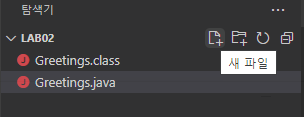
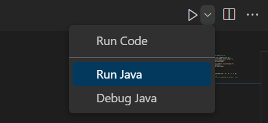
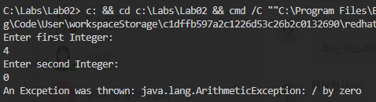

= Lab 2-3: 예외 처리

이 연습에서는 예외 처리를 사용하여 예기치 못한 런타임 오류를 처리하는 코드를 작성합니다. 프로그램은 두 개의 정수를 입력하라는 메시지를 표시하고, 첫 번째 정수를 두 번째 정수로 나누고 결과를 출력합니다.

== Java 응용 프로그램 생성
1.	Visual Studio Code의 탐색기 창에서 새 파일 아이콘을 클릭합니다.
+

+
2.	파일 이름을 Divide.java로 지정합니다.
3.	Divide.java 파일에 java.util 패키지의 Scanner 클래스를 import하는 코드를 작성하고 아래와 같이 Divide 클래스를 작성합니다.
+
[source, java]
----
import java.util.Scanner;

public class Divide {
    public static void main(String[] args) {

    }
}
----
+
4.	파일을 저장합니다.

== 두 정수를 입력 받는 코드 작성

1.	main 메소드에서, 첫 번째 정수를 입력 받는 코드를 작성합니다.
2.	키보드 표준 입력으로 받은 정수를 String 타입의 temp 변수에 할당합니다.
3.	temp 변수에 할당된 값을 Integer 클래스의 parseInt 메소드를 사용하여 정수형 변수 i 에 할당합니다.
+
[source,java]
----
int i = Integer.parseInt(temp);
----
+
4.	같은 방식으로, 두 번째 정수를 입력 받아 int 형 변수에 할당하는 코드를 작성합니다.
5.	scanner를 닫습니다.
6.	완성된 코드는 아래와 유사할 것입니다.
+
[source, java]
----
Scanner scanner = new Scanner(System.in);

System.out.println("Enter first Integer:");
String temp = scanner.nextLine();
int i = Integer.parseInt(temp);

System.out.println("Enter second Integer:");
temp = scanner.nextLine();
int j = Integer.parseInt(temp);

scanner.close();
----
+
7.	코드를 저장합니다.

== 첫 번째 정수를 두 번째 정소로 나누는 코드 작성
1.	main 메소드의 끝에 scanner로 입력받아 i, j 두 변수에 할당한 값을 나누는 코드를 작성합니다.
+
[source, java]
----
int k = i / j;
----
+
2.	k 값을 출력하는 코드를 작성합니다.
+
[source, java]
----
System.out.printf("%d / %d = %d ", i, j, k);
----
+
3.	코드를 저장합니다.

== 프로그램 실행
1.	오른쪽 위, 화살표 옆의 ∨ 기호를 클릭하고 Run Java를 클릭합니다.
+

+
2.	프로그램이 실행되면, 첫 번째 변수로 4를 입력하고 Enter 키를 누릅니다.
3.	두 번째 변수로 2를 입력하고 Enter 키를 누릅니다.
4.	2가 출력되는 것을 확인합니다.
5.	F5키를 눌러 응용 프로그램을 다시 시작합니다.
6.	첫 번째 변수로 4를 입력합니다.
7.	두 번째 변수로 0을 입력합니다.
8.	ArithmetricException 예외가 발생하는 것을 확인합니다.
 
== 예외 처리 코드 삽입
1.	main 메소드의 전체 코드를 try 블록안에 위치하도록 코드를 수정합니다.
+
[source, java]
----
try {
	Scanner scanner = new Scanner(System.in);
	System.out.println("Enter first Integer:");
	String temp = scanner.nextLine();
	int i = Integer.parseInt(temp);

	System.out.println("Enter second Integer:");
	temp = scanner.nextLine();
	int j = Integer.parseInt(temp);

	scanner.close();

	int k = i / j;

	System.out.printf("%d / %d = %d ", i, j, k);
}
----
+
2.	main 메소드에 catch 문을 추가합니다. catch 문은 예외가 발생했다는 단순한 메시지와 예외의 종류를 출력합니다.
+
[source, java]
----
catch (Exception e) {
	System.out.println("An Excpetion was thrown: " + e);
}
----
+
3.	완성된 main 메소드의 코드는 아래와 유사할 것입니다.
+
[source, java]
----
public static void main(String[] args) {
	try {
		Scanner scanner = new Scanner(System.in);
		System.out.println("Enter first Integer:");
		String temp = scanner.nextLine();
		int i = Integer.parseInt(temp);

		System.out.println("Enter second Integer:");
		temp = scanner.nextLine();
		int j = Integer.parseInt(temp);

		scanner.close();

		int k = i / j;

		System.out.printf("%d / %d = %d ", i, j, k);
	}
	catch (Exception e) {
		System.out.println("An Exception was thrown: " + e);
	}
}
----
+
4.	F5키를 눌러 응용 프로그램을 시작합니다.
5.	첫 번째 변수로 4를 입력합니다.
6.	두 번째 변수로 0을 입력합니다.
7.	예외가 처리되는 것을 확인합니다.
+

link:./23_lab2-2.adoc[이전: ab 2-2: 디버깅]