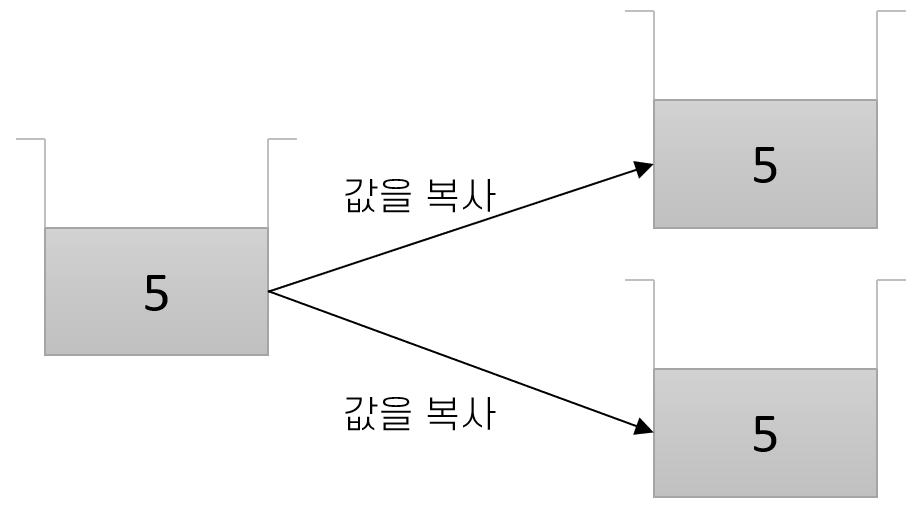
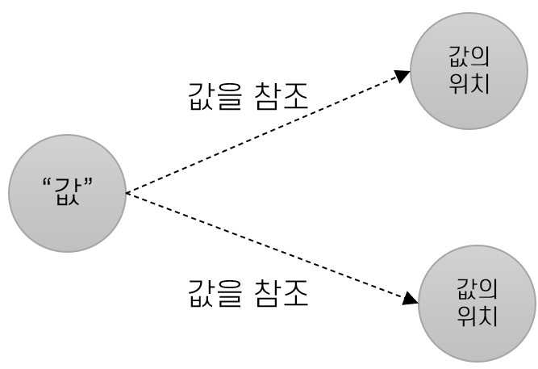

= 값 타입과 참조 타입

* 값 타입(Value Type)
** 데이터를 직접 포함
** 복사된, 직접 가지는 데이터를 저장
** 한 연산이 다른 데이터에 영향을 미치지 않음
** 스택(Stack) 영역에 데이터 저장
* 참조 타입(Reference Type)
** 데이터(객체)가 있는 곳의 위치를 저장
** 두 참조 타입 변수는 같은 객체를 가리킬 수 있음
** 한 연산이 다른 데이터에 영향을 끼칠 수 있음
** 힙(Heap)영역에 저장

---

== 값 타입(Value Type)

값 타입 변수는 스택 영역에 저장되며, 해당 데이터가 직접 포함됩니다. 각 값 타입 변수에는 복사된 데이터가 존재하므로 한 변수에 대한 어떤 작업도 다른 변수에 영향을 미치지 않습니다.
 

== 참조 타입(Reference Type)

참조 타입 변수에는 해당 데이터에 대한 참조가 포함됩니다. 참조 타입 변수에 대한 데이터는 변수가 존재하는 곳이 아닌 위치가 존재하는 다른 곳에 저장되고 변수는 그 데이터가 있는 곳(주소)를 가리킵니다. 두 개의 참조 타입 변수는 같은 개체를 가리킬 수 있으므로 한 참조 타입 변수에 대한 작업이 다른 변수에서 참조하는 개체에 영향을 미칠 수 있습니다. Java에서 모든 참조 타입은 `java.lang.Object` 의 서브 타입입니다.

link:./02_value_ref.adoc[이전: 값 타입과 참조 타입] +
link:./04_java_primitive_data_type.adoc[다음: Java 기본 데이터 타입]