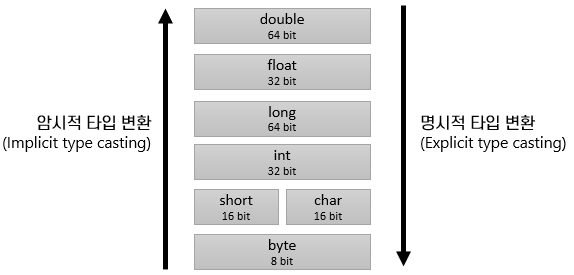

= 기본 데이터 타입 변환 규칙

* 타입의 메모리 공간 크기를 기준으로 변환하지 않음
* 값의 표현 범위를 기준으로 변환

---

Java에서 기본 데이터 타입의 변환은 각 타입의 메모리 공간 크기를 기준으로 하지 않고, 값의 표현 범위를 기준으로 합니다.

정수만을 표현할 수 있는 타입보다 실수를 표현할 수 있는 타입이 값의 표현 범위가 넓습니다. 단정도 float는 같은 메모리 공간 크기를 가지는 int보다 더 큰 정수를 표현할 수 있습니다.

link:./11_type_casting.adoc[이전: 데이터 타입 변환] +
link:./13_implicit_casting.adoc[다음: 암시적 타입 변환]