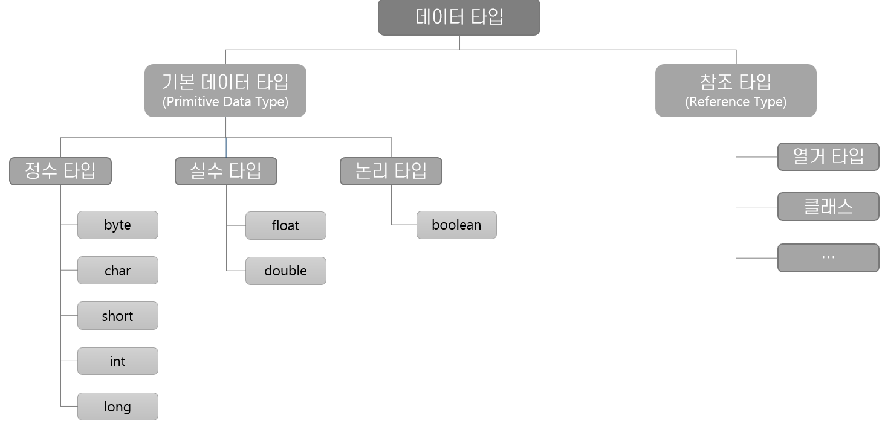

= Java 데이터 타입

* Java 에서는 기본 데이터 타입(Primitive Data Type = 값 타입)과 참조 타입을 지원

---

Java는 값을 저장하는 기본 데이터 타입(Primitive Data Type)과 주소를 저장하는 참조 타입(Reference Type) 두 가지 타입을 지원합니다.

Java에서 기본 타입 변수는 실제 값(data)를 저장하는 반면, 참조 타입 변수는 어떤 값이 저장되어 있는 주소(memory address)를 저장합니다. Java는 C나 C++, C#등의 언어와 달리 참조 연산을 할 수 없으므로, Java에서 모든 값은 변수에 저장된 값(참조 타입의 경우 주소가 가리키는 곳이 아닌)으로 전달됩니다.

link:./03_valuetype_reftype.adoc[이전: 값 타입과 참조 타입] +
link:./05_primitive_data_type.adoc[다음: 기본 데이터 타입]