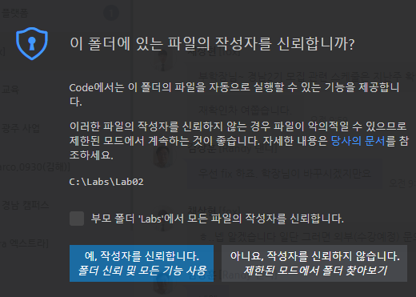
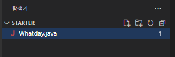
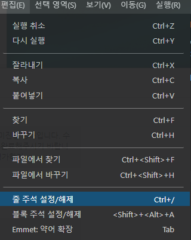

= Lab 4-1: 연도 일자를 월/일로 계산

이 연습에서는 표준 입력으로 정수 형식의 일 수 (1에서 385 사이)를 읽어서 월고 일로 변환한 다음 표준 출력하는 프로그램을 작성합니다. 예를 들어 40을 입력하면 “February 9”을 출력합니다. (이 연습에서는 윤년이 무시됩니다)

== 연습 1. 입력 받은 숫자로 월/일 계산

**표준 입력에서 일자 숫자 읽기**

1.	Visual Studio Code를 엽니다.
2.	파일 메뉴에서 폴더 열기를 클릭하고 c:\Labs\Lab04-1\Strarter 폴더를 엽니다.
3.	작성자 신뢰 경고 창에서, 예, 작성자를 신뢰합니다. 버튼을 클릭합니다.
+

+
4.	Visual Studio Code 탐색기에서 Whatday.java 파일을 엽니다.
+

+
5.	1에서 365사이의 숫자를 입력하라는 문자열을 프롬프트에 출력하는 `System.out.print` 문을 작성합니다.
6.	`Scanner` 타입 객체를 표준 입력을 파라미터로 생성하고, 생성한 `Scanner` 클래스 인스턴스를 사용하여 입력 받은 1부터 365 사이의 값을 포함하는 문자열을 `String` 타입 변수 `line` 에 할당하는 코드를 작성합니다.
7.	정수형 변수 `daynum` 을 선언하고 `line` 에 할당된 문자열을 정수로 변환하여 할당합니다.
8.	작성된 코드는 아래와 유사할 것입니다.
+
[source, java]
----
public static void main(String[] args) {
    System.out.print("Enter a digit 1 between 365: ");
    Scanner scanner = new Scanner(System.in);
    String line = scanner.nextLine();
    int dayNum = Integer.parseInt(line);

    //
    // To do: add code here
    // 
    …
}
----
+
9.	파일을 저장합니다.
10.	Whatday.java 파일을 컴파일하고 오류가 있으면 수정합니다.

**일자에서 월/일 계산**

1.	`main` 메소드에 `monthNum` 이라는 이름의 `int` 형 변수를 선언하고 0으로 초기화합니다.
2.	1부터 10월까지 날짜와 월을 제공하는 `if` 절이 제공됩니다. if 문의 주석을 제거하고, 11월과 12월에 해당하는 월 수와 날짜를 계산하는 `if` 절을 추가합니다.
+
|===
|**Tip** 여러 줄 및 블록 주석을 위해 Visual Studio Code가 제공하는 기능을 사용할 수 있습니다. 편집 메뉴의 줄 주석 설정/해제 기능과 블록 주석 설정/해제 기능을 사용하면 여러 줄 및 블록 주석을 쉽게 설정하고 해제할 수 있습니다.

|===
+
3. `if` 절이 끝나는 부분에 String 타입 변수 monthName을 선언합니다.
4.	1월부터 10월까지 월 이름을 처리하는 `switch` 문이 제공됩니다. `switch` 문의 주석을 제거하고 11월과 12월에 대한 두 레이블을 추가하고, `default` 레이블에 문자열 “Not set”을 추가하는 명령문을 추가합니다.
5.	`switch` 문 아래에, `System.out.printf` 메소드를 사용하여 `dayNum` 변수의 값과 `monthName` 변수의 값을 출력하는 코드를 작성합니다.
6.	완성된 코드는 아래와 유사할 것입니다.
+
[source, java]
----
import java.util.Scanner;

public class Whatday {
    public static void main(String[] args) {
        System.out.print("Enter a digit 1 between 365: ");
        Scanner scanner = new Scanner(System.in);
        String line = scanner.nextLine();
        int dayNum = Integer.parseInt(line);
        
        int monthNum = 0;

        if (dayNum >= 31) {     // January
            monthNum++;
            dayNum -= 31;
        }

        if (dayNum >= 28) {     // Feburary
            monthNum++;
            dayNum -= 28;
        }

        if (dayNum >= 31) {     // March
            monthNum++;
            dayNum -= 31;
        }

        if (dayNum >= 30) {     // April
            monthNum++;
            dayNum -= 30;
        }

        if (dayNum >= 31) {     // May
            monthNum++;
            dayNum -= 31;
        }

        if (dayNum >= 30) {     // June
            monthNum++;
            dayNum -= 30;
        }

        if (dayNum >= 31) {     // July
            monthNum++;
            dayNum -= 31;
        }

        if (dayNum >= 31) {     // August
            monthNum++;
            dayNum -= 31;
        }

        if (dayNum >= 30) {     // September
            monthNum++;
            dayNum -= 30;
        }

        if (dayNum >= 31) {     // October
            monthNum++;
            dayNum -= 31;
        }

        if (dayNum >= 30) {     // November
            monthNum++;
            dayNum -= 30;
        }

        if (dayNum >= 32) {     // December
            monthNum++;
            dayNum -= 31;
        }

        String monthName = "";

        switch(monthNum) {
            case 0:
                monthName = "January";
                break;
            case 1:
                monthName = "Feburary";
                break;
            case 2:
                monthName = "March";
                break;
            case 3:
                monthName = "April";
                break;
            case 4:
                monthName = "May";
                break;
            case 5:
                monthName = "June";
                break;
            case 6:
                monthName = "July";
                break;
            case 7:
                monthName = "August";
                break;
            case 8:
                monthName = "September";
                break;
            case 9:
                monthName = "October";
                break;
            case 10:
                monthName = "November";
                break;
            case 11:
                monthName = "December";
                break;
            default:
                monthName = "Not Set";
                break;
        }

        System.out.printf("%s, %d ", monthName, dayNum);
    }
}
----
+
7. Whatday.java 프로그램을 컴파일하고 오류가 있으면 수정합니다. 성공적으로 컴파일되면 프로그램을 실행합니다. 프로그램의 입력 문자열에 따라 아래와 같은 값이 출력되는지 확인합니다.
+
----
Day number	Month and day
32	February, 1
60	March, 1
93	April, 3
258	September, 15
335	December, 1
364	December, 30
----

**배열을 사용하여 월의 이름을 계산**

1. 월 번호를 사용해서 월 이름을 교체하는 `switch` 문을 보다 간결하게 변경합니다. `Whatday` 클래스의 위쪽에서 `monthNames` 배열을 확인합니다.
+
[source, java]
----
static String[] monthNames = {"January", "Feburary", "March", "April", "May", "June", "July", "August", "Sepetember", "October", "November", "December"};
----
+
2. `switch` 문 전체를 주석 처리합니다.
3. `switch` 문 대신 `monthName` 이라는 `String` 타입 변수를 선언하고 `monthNum` 변수 값에 해당하는 `monthNames` 배열의 값을 할당하는 코드를 작성합니다. 아래와 같습니다.
+
[source, java]
----
String monthName = monthNames[monthNum];
----
+
4. `scanner` 를 닫습니다.
5.	완성된 코드는 아래와 유사할 것입니다.
+
[source, java]
----
import java.util.Scanner;

public class Whatday {
    public static void main(String[] args) {
        System.out.print("Enter a digit 1 between 365: ");
        Scanner scanner = new Scanner(System.in);
        String line = scanner.nextLine();
        int dayNum = Integer.parseInt(line);

        int monthNum = 0;

        // if 문을 사용하여 월 번호와 일수를 계산하는 코드 	

        String monthName = monthNames[monthNum];

        System.out.printf("%s, %d \n", monthName, dayNum);
        scanner.close();
    }
}
----
6.	작업을 저장합니다.
7.	Whatday.java 프로그램을 컴파일하고 오류가 있으면 수정합니다. 성공적으로 컴파일되면 프로그램을 실행합니다. 코드가 줄었지만 프로그램은 동일하게 동작하는 것을 확인합니다.

link:./16_break_continue.adoc[이전: break와 continue statement(break 문과 continue 문)] +
link:./18_exercise.adoc[다음: 연습문제]
