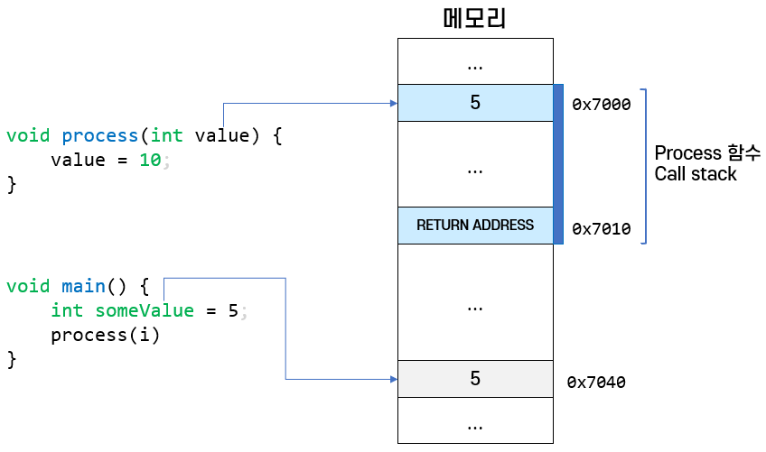
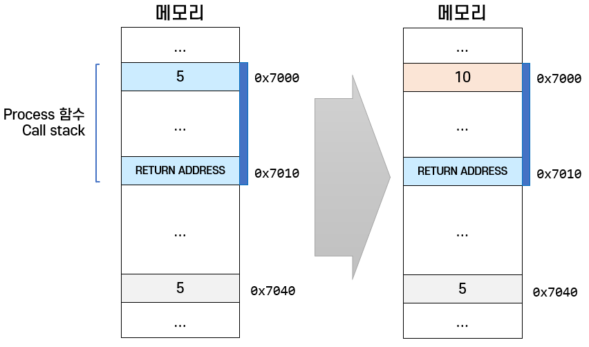
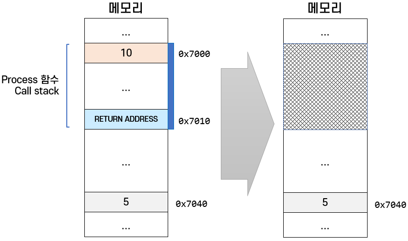
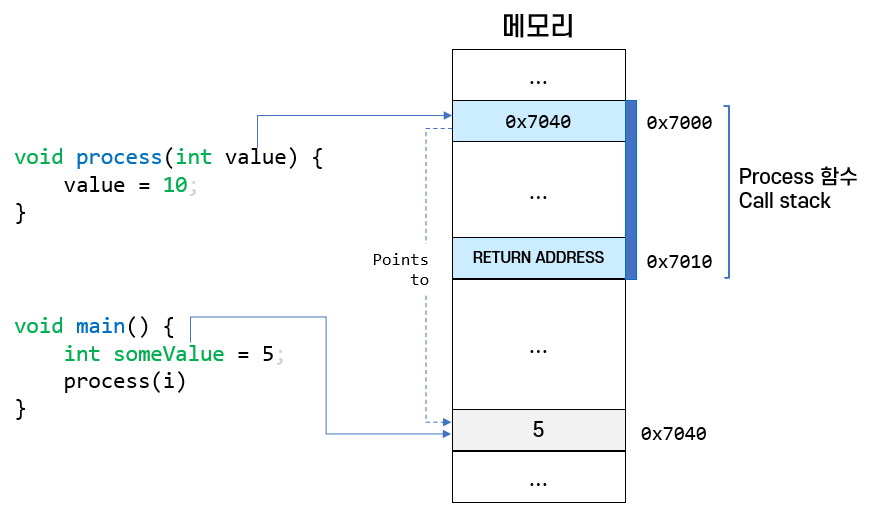
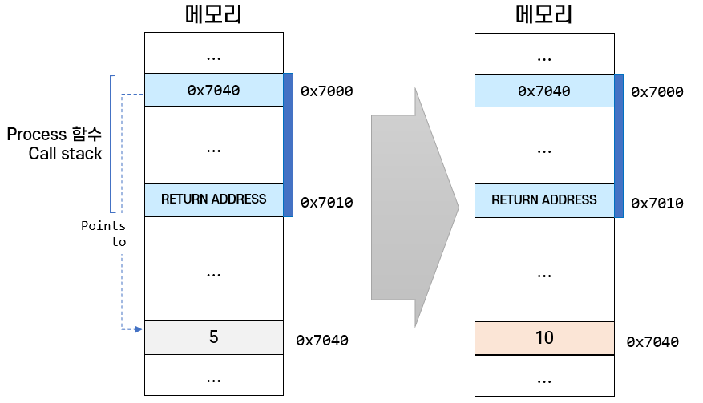
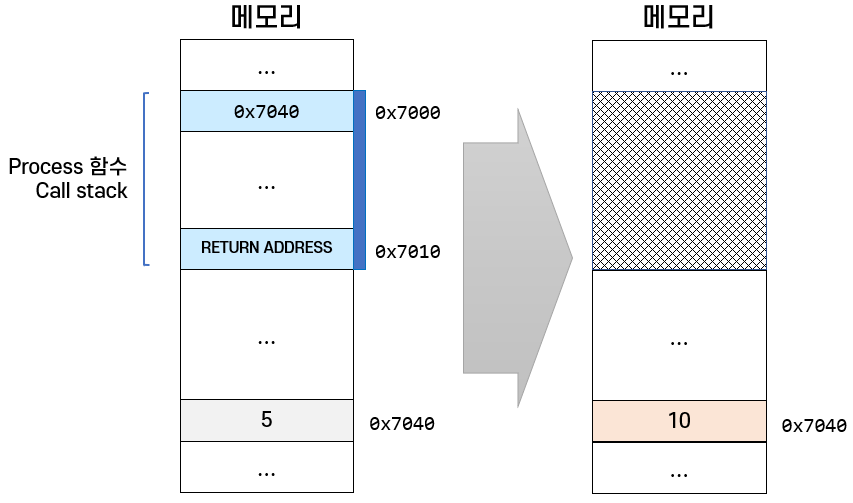

= 파라미터 전달 메커니즘

* Pass by Value
** 값을 복사해서 전달
** 값을 수정해도 원본 데이터에는 영향을 미치지 않음
* Pass by Reference
** 주소 값을 전달 – 실제 값이 있는 위치를 전달
** 값을 수정하면 원본 데이터의 값에 영향을 미침
* Java는 모든 파라미터 전달에 Pass by Value를 사용함

---

Java, C/C++. C#등 여러 언어에서 값을 전달하는 방식에는 크게 두 가지가 있습니다.

== Pass by Value
Pass by Value는 값을 직접 전달하는 방식으로 파라미터로 전달되는 값을 복사하여 전달합니다. 따라서 파라미터로 전달받은 인자 값을 전달해도 원본 값에는 영향을 미치지 않습니다.

**예제 코드(C++)**

[source, c++]
----
void process(int value) {
    cout << "전달받은 파라미터의 인자 값: " << value << endl;
    value = 10;
    cout << "함수 내에서 변경한 파라미터의 인자 값: " << value << endl;
}

int main() {
    int i = 5;
    cout << "선언한 변수의 초기 값: " << i << endl;
    process(i);
    cout << "process 함수 호출 후 변수의 값: " << i << endl;
    return 0;
}
----

함수 `process` 는 `int` 타입 `value` 를 파라미터로 가지고 있습니다. `main` 함수는 process를 호출하면서 5 값을 가진 int 타입 변수 `i` 를 인자로 전달했습니다.

`process` 함수는 전달받은 값을 10으로 변경하고 종료합니다. 두 함수는 파라미터를 전달받기 전, 전달받은 후, 전달받은 값을 변경한 후 및 함수가 종료된 후의 값을 모두 출력합니다. 코드의 실행 결과는 아래와 같습니다.

----
선언한 변수의 초기 값: 5
전달받은 파라미터의 인자 값: 5
함수 내에서 변경한 파라미터의 인자 값: 10
process 함수 호출 후 변수의 값: 5
----

process 함수에서 해당 값을 수정해도 해당 함수가 종료되고 나면 원본 값을 기존 상태를 유지합니다.

**동작 방식**

C/C++에서, 함수를 호출하면 Stack 메모리에 함수의 return address가 쌓이고 그 위에 파라미터 등의 값이 쌓이게 됩니다. main 함수에서 process 함수가 호출되는 순간의 메모리 할당을 그림으로 그려보면 아래와 같습니다.

처음으로 `main` 함수를 호출했으므로 `main` 함수가 메모리에 존재하게 되고, `main` 함수의 지역변수로 선언한 `someValue` 가 stack에 할당됩니다. 이후 `process` 함수를 호출하면서 `process` 함수의 Call Stack이 생성되고, process 함수의 Call Stack에 return address와 파라미터 인자 `value` 가 할당됩니다. `value` 에는 `main` 함수의 지역변수 `someValue` 의 값이 복사됩니다.

그 후 process 함수에서 전달받은 value의 값을 10으로 변경했습니	다 그 때의 메모리 할당은 아래와 같습니다.

`process` 함수에서 파라미터 인자로 전달된 `value` 의 값을 5에서 10으로 변경했습니다. 이때, `main` 함수의 `someValue` 변수와 `process` 함수의 `value` 변수는 다른 Call Stack에 할당된 다른 값입니다. main 함수의 스택에 할당된 someValue 변수의 값은 바뀌지 않고, `process` 함수의 스택에 할당된 `value` 파라미터 인자의 값만 변경됩니다.

이후 process 함수는 종료됩니다. 그 때의 메모리 할당은 아래와 같습니다.

process 함수에 할당된 Call Stack은 해제되고 할당되었던 모든 파라미터와 지역 변수 역시 해제됩니다. 따라서, main 함수에서 process 함수로 전달되었던 someValue 값에는 변화가 없습니다.

== Pass by Reference

Pass by Reference는 주소 값, 즉 실제 값이 있는 위치를 전달하는 방식으로, 파라미터의 인자로 전달받은 값을 수정하면 원본 데이터의 값에도 영향을 미치는 전달방식입니다.

**예제 코드(C++)**

[source, c++]
----
void process(int& value) {
    cout << "전달받은 파라미터의 인자값: " << value << endl;
value = 10;
    cout << "함수 내에서 변경한 파라미터의 인자값: " << value << endl;
}

int main() {
    int i = 5;
    cout << "선언한 변수의 초기 값: " << i << endl;
    process(i);
    cout << "process 함수 호출 후 변수의 값: " << i << endl;
    return 0;
}
----

`process` 함수의 파라미터 `value` 의, 타입이 int가 아닌 `int&` 타입인 것을 제외하면 함수 process의 코드는 이전 예제와 동일합니다. 차이점은 Pass by Value는 값을 복사하여 전달하지만, &를 사용하여 주소 값, 즉 주소에 대한 참조(Reference)를 전달한다는 것입니다. 코드의 실행 결과는 아래와 같습니다.

----
선언한 변수의 초기 값: 5
전달받은 파라미터의 인자 값: 5
함수 내에서 변경한 파라미터의 인자값: 10
process 함수 호출 후 변수의 값: 10
----

**동작 방식**

메모리에 main 함수와 process 함수의 Call Stack이 할당되는 등의 동작은 Pass by Value에서와 동일합니다. main 함수에서 someValue 변수를 파라미터의 인자로 process 함수를 호출했을 때의 메모리 할당은 다음과 같습니다.

다른 점은 `process` 함수에 파라미터 인자로 전달된 _someValue_ 의 주소 값, 즉 주소에 대한 참조(reference)가 전달되어 process 함수의 파라미터 value는 main 함수의 변수 someValue와 동일한 메모리 공간을 바라보게 됩니다.

이후 process 함수에서 value 파라미터 인자 값을 10으로 변경하면 참조하는 주소 값이 있는 위치의 값을 변경합니다. 그 때의 메모리 할당은 아래와 같습니다.

값이 직접 복사되어 주소값 0x7000에 저장된 값을 변경하지 않고 int& 타입으로 전달받은 주소에 있는 값을 변경했습니다. 따라서, 파라미터에 할당된 주소 공간에 저장된 값을 변경하지 않고 전달받은 주소 값에 해당하는 공간에 있는 값을 변경하여, 결과로 main 함수의 변수 someValue의 값이 변경되었습니다.

이후 process 함수는 종료됩니다. process 함수가 종료된 후 메모리 할당은 다음과 같습니다.

process 함수에 할당된 Call Stack은 해제되고 할당되었던 모든 파라미터와 지역 변수 역시 해제됩니다. process 함수의 호출 결과로 main 함수의 someValue 변수에 저장된 값이 변경되었습니다.

== Java에서의 파라미터 전달

Java는 &를 사용해서 주소 값을 전달하는 식의 Pass by Reference를 할 수 없습니다. Java에서 모든 값 타입 파라미터는 Pass by Value로 전달됩니다.

link:./09_parameter_declaration.adoc[이전: 파라미터 선언과 호출] +
link:./11_pass_by_value.adoc[다음: Pass by Value]