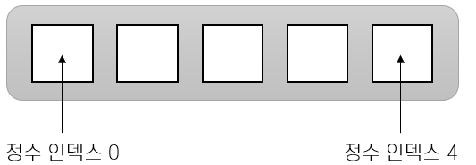

= 배열이란?

* 배열은 요소를 순서대로 모아서 관리하기 위해 만들어진 자료구조
* 배열의 모든 요소는 같은 타입을 가짐
* 각각의 요소에는 정수 인덱스를 사용해서 액세스

---

배열은 요소를 순서대로 모아서 관리하기 위해 만들어진 자료구조입니다. 인덱스라고 부르는 정수로 만들어진 위치를 사용하여 배열내 각각의 요소에 액세스 할 수 있습니다.

배열은 임의 접근(Random Access)를 허용합니다. 이는 프로그램의 배열의 요소에 순서와 관계없이 빠르게 액세스 할 수 있음을 의미합니다.

link:./02_overview_array.adoc[이전: 배열 개요] +
link:./04_array_in_java.adoc[다음: Java에서 배열 표기법]