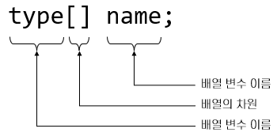

= Java에서 배열 표기법

* 다음 항목들을 지정하여 배열 선언:
* 배열에 나열될 요소들의 타입
* 배열의 차원
* 배열을 선언한 변수 이름

---

Java의 배열 표기법은 C/C++, C#등 다른 언어들과 비슷합니다. 먼저 타입을 지정한 다음 변수 이름뒤에 세미 콜론을 지지정합니다. 그리고 대괄호를 사용하여 배열을 선언합니다.

Java에서 배열을 선언하는 방법은 크게 두 가지가 있습니다.

* 생성할 배열의 타입을 선언한 후 대 괄호를 붙이고 뒤에 변수 이름을 선언하는 방법
+
[source, java]
----
type[] arrayName;
----
+
* 타입을 선언하고 뒤에 변수를 선언한 후 변수에 대 괄호를 붙이는 방법
+
[source, java]
----
type arrayName[]
----

배열을 선언하며 배열의 크기를 지정할 수는 없습니다.
[source, java]
----
type[3] arrayName; 	// 허용되지 않음
----

link:./03_whatisarray.adoc[이전: 배열이란?]
link:./05_dimension.adoc[다음: 배열의 차원]