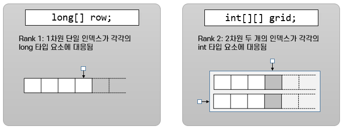

= 배열의 차원

* 선형 1차원 배열과 표형 2차원 배열, 육면체형 2차원 배열을 선언할 수 있음
* 인덱스가 배열의 각 요소와 연관됨
* 2차원 이상의 배열은 한 배열에 여러 배열이 포함되어 있는 형태
* 배열에 포함된 배열은 각각의 인덱스를 가짐

---

1차원 배열을 선언하려면 한 쌍의 대괄호를 사용합니다. 이렇게 선언된 배열은 하나의 정수 인덱스가 배열의 각 요소와 연관되기 때문에 Rank 1 배열이라고도 합니다.

2차원 배열을 선언할 때는 두 쌍의 대괄호를 사용합니다. 두 쌍의 대괄호를 사용해 선언된 배열은 두 개의 정수 인덱스가 배열의 각 요소와 연관되기 때문에 Rank 2 배열이라고도 합니다. 

Java에서 다차원 배열을 선언하는 것은 대괄호의 개수에 따라 명확한 방식으로 확장됩니다. 대괄호 쌍의 수에 따라 Rank가 하나씩 증가합니다.

배열 변수 선언시에는 각 차원의 길이를 포함하지 않아야 합니다.

link:./04_array_in_java.adoc[이전: Java에서 배열 표기법] +
link:./06_array_element_access.adoc[다음: 배열 요소에 접근]