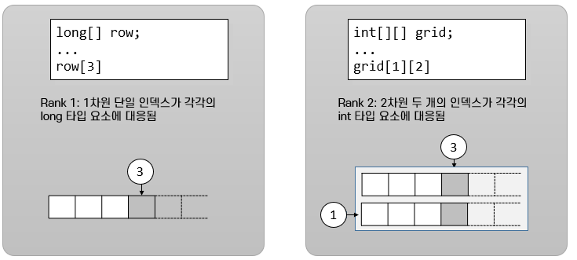
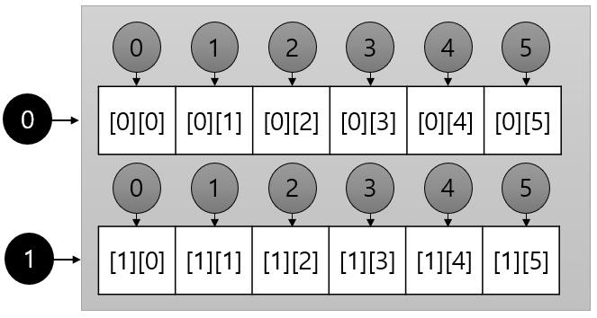

= 배열 요소에 접근

* 각 배열에 대해 정수 인덱스가 제공됨
* 인덱스는 0에서 시작함

---

배열의 각 요소에 액세스하려면 배열 변수를 선언하는데 사용하는 구문과 비슷한 구문을 사용합니다. 대괄호 사이에 액세스할 배열의 요소에 부여된 인덱스를 넣어 원하는 요소에 액세스 합니다. 이 사용법은 C/C++, C#과 같은 언어에서와 동일합니다. 선언과 사용이 유사하기 때문에 배열 변수 선언과 요소에 액세스 식을 잘 구분해야 합니다.

배열의 차원에 따라 인덱스의 개수가 다릅니다. 1차원 배열은 하나의 인덱스를 가지고 있어 1차원 배열의 요소에 액세스하려면 하나의 정수 인덱스를 사용합니다. 2차원 배열은 두 개의 인덱스를 가지고 있어, 2차원 배열의 요소에 액세스 하려면 2개의 인덱스를 사용해야 하며, 3차원 배열의 요소는 3개의 인덱스를 사용해야 합니다.

모든 배열의 인덱스는 0에서 시작합니다. 배열의 첫 번째 요소에 액세스 하려면 다음과 같은 식을 사용합니다.

----
row[0];
----

다음 요소에 액세스하려면 아래와 같이 합니다:

----
row[1]
----

여기에서 오는 잠재적인 혼란을 피하기 위해, 배열의 첫 번째 요소를 “첫 번째 요소”라고 부르지 않고 “초기 요소”라고 부르기도 합니다. 0부터 인덱싱한다는 것은 배열의 마지막 요소의 위치가 배열의 크기가 아닌 배열의 크기 - 1이라는 것을 의미합니다. 마지막 요소에 액세스 하기 위해 배열의 크기를 사용하는 것은 흔히 하는 실수입니다. 이 실수는 때로 치명적인 상황을 부를 수 있습니다.

Java에서 다차원 배열은 배열내에 선언되는 배열 형태입니다. 다차원 배열 내의 각 배열은 각각의 정수 인덱스를 가집니다. 아래와 같이 선언된 2차원 배열의 경우,

----
int[][] grid;
----

grid는 하나의 배열(부모 배열) 안에 여러 개의 배열(자식 배열)이 포함되는 형태가 되며, 부모 배열은 각각의 자식 배열에 대해 정수 인덱스를 가집니다.
 

link:./05_dimension.adoc[이전: 배열의 차원]
link:./07_array_boundary.adoc[다음: 배열의 경계 검사]