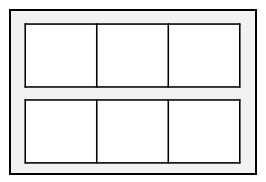

= 배열의 경계 검사

* 배열은 크기가 정해져 있어, 요소 액세스를 위해 배열 경계를 검사함
* 배열 내 잘못된 위치에 대한 접근은 ArrayIndexOutofBoundsException 예외를 발생
* length 변수 사용

image:./images/image06.png[]

---

Java에서는 배열의 요소에 액세스하는 식이 자동으로 검사되어 인덱스가 유효한지 확인합니다. 이 암시적 경계 검사는 사용자가 임의로 동작하지 않도록 설정할 수 없습니다. 경계 검사는 Java가 안전한 언어인지 확인할 수 있는 방법중의 하나입니다.

배열의 경계가 자동으로 확인되더라도 정수 인덱스가 경계 내에 있는지 확인해야 합니다. 이를 위해서 반복문을 사용할 경우 종료 조건을 확인하여 인덱스 범위를 수동으로 확인해야 합니다. 아래는 `for` 문의 예입니다.

[source, java]
----
for (int i = 0; i < row.length; i++) {
    System.out.println(i);
}
----

배열의 `length` 는 배열의 요소수를 나타냅니다. 다차원 배열일 경우 다차원 배열에 포함된 각각의 배열의 길이를 나타내므로, 아래와 같은 배열의 변수명이 `grid` 인 경우, 

`grid(부모 배열)` 의 `length` 는 2, `grid[0]` 과 `grid[1](자식 배열들)` 의 `length` 는 3이 됩니다. for문 종료 조건으로 2차원 배열의 경계 확인은 다음과 같이 할 수 있습니다:

[source, java]
----
for (int i = 0; i < grid.length; i++) {
    for (int j = 0; j < grid[i].length; j++) {
        System.out.println(grid[i][j]);
    }
}
----

link:./06_array_element_access.adoc[이전: 배열 요소에 접근] +
link:./08_array_collection.adoc[다음: 배열과 컬렉션 비교]