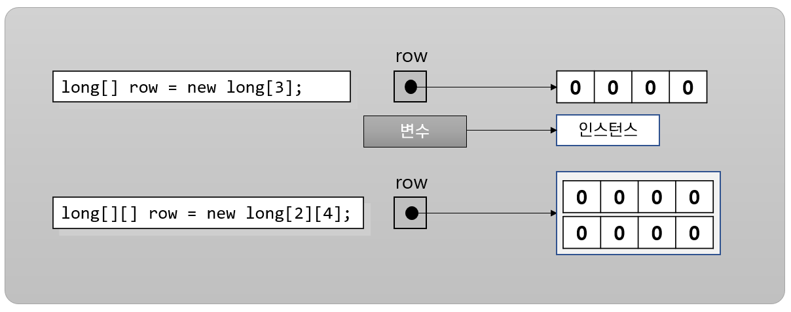

= 배열 인스턴스 생성

* 배열 변수를 선언한다고 해서 배열이 생성되지 않음
* new 키워드를 사용해서 명시적으로 배열 인스턴스를 생성해야 함
* 배열이 생성되면 기본 값이 암시적으로 할당됨

---

배열 변수를 선언한다고 해서 배열이 생성되지 않습니다. 이는 배열이 값 타입이 아니라 참조타입이기 때문입니다. new 키워드를 사용하여 배열 인스턴스를 생성해야 합니다. 배열 인스턴스를 생성할 때 모든 차원의 배열 크기를 지정해야 합니다. 다음과 같이 배열의 크기를 지정하지 않으면 컴파일시에 오류가 발생합니다.

----
int[] row = new int[];
int[][] grid = new grid[][];
----

Java 컴파일러는 암시적으로 각 배열 요소를 배열 요소 유형에 따라 기본값으로 초기화 합니다. 정수 타입 배열 요소는 암시적으로 0으로 초기화되고, 부동 소수점 배열 요소는 0.0으로 초기화 됩니다. boolean 배열 요소는 false로 초기화됩니다.

----
int[] row = new int[5];
----

런타임에는 실제적으로 아래와 같이 실행됩니다.

----
int[] row = new int[5];
row[0] = 0;
row[1] = 0;
row[2] = 0;
row[3] = 0;
row[4] = 0;
----

link:./09_array_creation.adoc[이전: 배열 생성] +
link:./11_initiate_element.adoc[다음: 배열 요소 초기화]