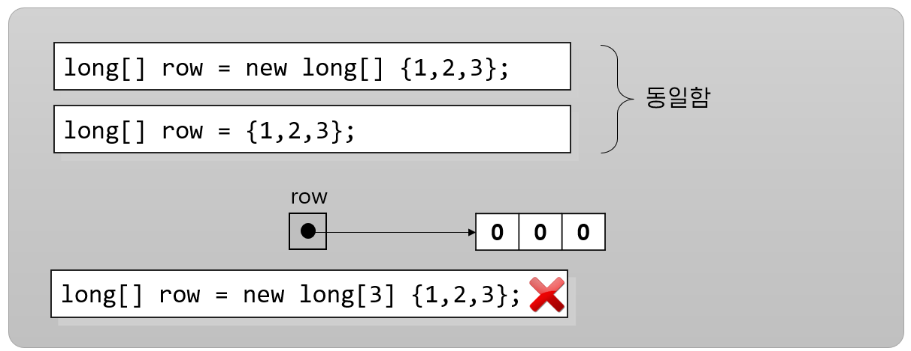

= 배열 요소 초기화

* 배열의 요소는 선언시 명시적으로 초기화될 수 있음
* 편리하게 줄여 쓸 수 있는 방법 제공
* 선언 시 초기화 할 때 배열의 크기를 사용할 수 없음

---

배열 이니셜라이저를 사용해서 배열 인스턴스 요소의 값을 초기화 할 수 있습니다. 배열 이니셜라이저는 중괄호로 묶이고 쉼표로 구분된 일련의 식입니다. 배열 이니셜라이저는 왼쪽에서 오른쪽으로 실행되며, 다음과 같이 메소드 호출과 복잡한 식을 사용할 수 있습니다:

[source, java]
----
int[ ] data = new int[] {a, b( ), c*d, e( )+f( )};
----

배열을 이니셜라이저를 사용하여 생성할 때는 배열의 크기를 정의할 수 없습니다.

[source, java]
----
int[ ] data = new int[4] {a, b( ), c*d, e( )+f( )};	// 컴파일 타임 오류
----

배열 변수 선언의 일부로 배열 인스턴스 요소를 초기화 할 때 단축 표기법을 사용할 수 있습니다.

[source, java]
----
int[] data1 = new int[] {1,2,3,4};	// 허용
int[] data2 = {1,2,3,4};	    	// 허용
data2 = new int[] {5,6,7,8};		// 허용
data2 = {9,10,11,12};			    // 허용되지 않음
----

link:./10_create_array_instance.adoc[이전: 배열 인스턴스 생성] +
link:./12_initiate_mutiple_dimension.adoc[다음: 다차원 배열 요소 초기화]