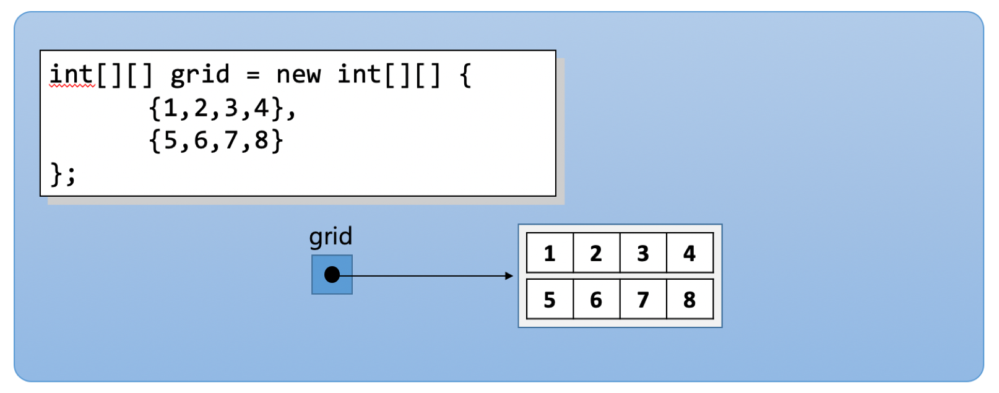

= 다차원 배열 요소 초기화

* 다차원 배열의 요소 또한 선언 시 명시적으로 초기화 할 수 있음
* 다차원 배열에 포함된 각 배열의 초기화는 일차원 배열 초기화 방법과 동일함

---

다차원 배열 인스턴스 또한 배열 선언 시 명시적으로 초기화 할 수 있습니다. Java에서 다차원 배열은 배열안에 배열이 포함되어 있는 형태입니다. 배열에 포함된 배열은 쉼표 ( , )로 구분합니다.

== 2차원 배열

[source, java]
----
int[][] grid = new int[][] {
    {1,2,3,4},  // grid[0] 배열
    {5,6,7,8}   // grid[1] 배열
};
----

== 3차원 배열

[source, java]
----
int[][][] cube = new int[][][] {
    {               	// cube[0] 배열
        {1,2,3,4},  	// cube[0][0] 배열
        {5,6,7,8}   	// cube[0][1] 배열
    },
    {
        {9,10,11,12},   // cube[1][0] 배열
        {13,14,15,16}   // cube[1][1] 배열
    }
};
----

link:./11_initate_element.adoc[이전: 배열 요소 초기화] +
link:./13_jagged_array.adoc[다음: 가변 길이 배열]