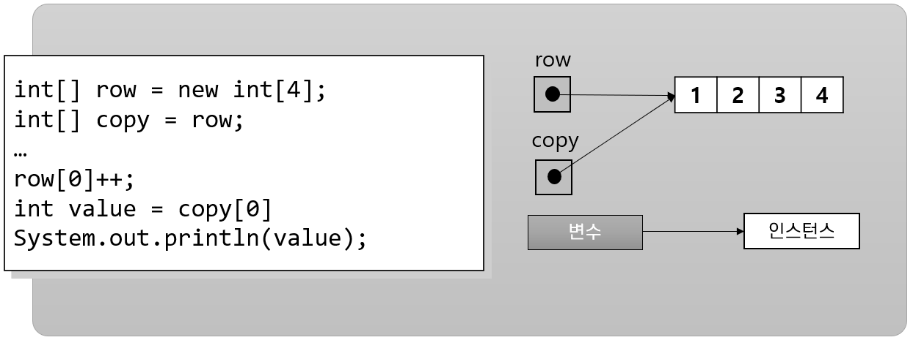
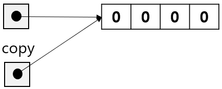
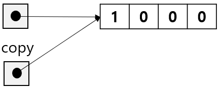

= 배열 요소 복사

* 배열을 복사하면 변수만 복사되고 값은 복사되지 않음
* 배열 인스턴스를 복사하지 않음
* 두 개의 배열 변수가 같은 배열 인스턴스를 가리킴

---

배열 변수를 다른 배열에 할당하면 배일 인스턴스의 전체 복사본을 얻을 수 없습니다. 아래 문은 정수 타입 배열 `row` 를 선언하고 인스턴스를 생성한 후, 역시 정수형 배열 `copy` 를 선언하고 `row` 배열을 `copy` 배열에 할당했습니다.

[source, java]
----
int[] row = new int[4];
int[] copy = row;
----

위 코드가 실행된 후 두 배열의 메모리 구조는 아래와 같이 됩니다:

아래 코드는 `row` 배열의 첫 번째 요소 값을 1 증가시킵니다.

[source, java]
----
row[0]++;
----

위 코드가 실행된 후 두 배열의 메모리 구조는 아래와 같이 됩니다:
 

`copy` 배열과 `row` 배열, 두 배열이 동일한 배열 인스턴스를 참조하기 때문에 `row[0]` 의 값을 변경하는 것은 두 배열 변수에서 정확히 동일한 효과를 나타냅니다.

link:./14_calcuated_length_array.adoc[이전: 계산된 크기를 가진 배열 생성] +
link:./16_using_array.adoc[다음: 배열 사용]