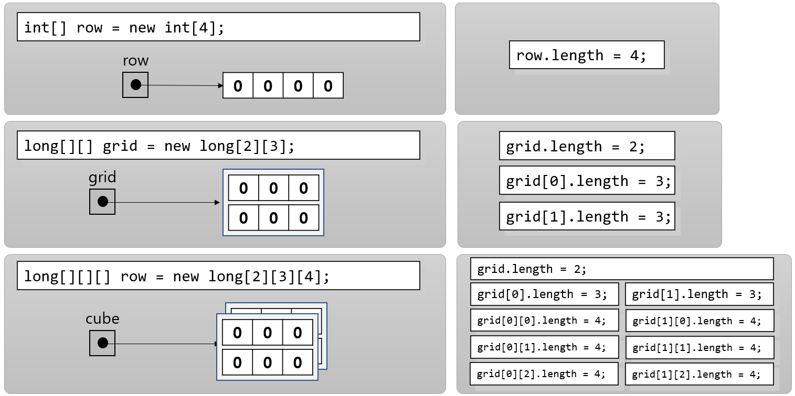

= 배열의 크기

---

Java에서 배열은 배열의 크기를 표시하는 `length` 만을 가지고 있습니다. `length` 는 읽기 전용 정수값으로, 배열에 포함된 요소의 크기를 나타냅니다.

앞에서 살펴보았듯이, Java에서 다차원 배열은 부모 배열이 자식 배열을 포함하고 있는 형태입니다. 배열의 `length` 값은 배열에 “포함된” 요소의 수를 나타냅니다.

예를 들어, 아래와 같은 2차원 배열이 있을 때:

[source, java]
----
int[][] matrix = new int[2][3];
----

`matrix` 배열은 요소로 두 개의 정수 타입 배열을 가집니다. 따라서 `matrix` 의 `length` 는 2가 됩니다. matrix 배열이 포함하고 있는 두 배열, `matrix[0]` 과 `matrix[1]` 은 각각 3개의 요소를 가집니다. 따라서 `matrix[0]` 과 `matrix[1]` 배열의 `length` 는 3이 됩니다.

link:./16_using_array.adoc[이전: 배열 사용] +
link:./18_method_of_array.adoc[다음: 배열 메소드]