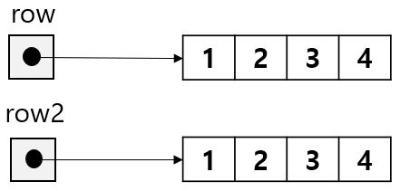

= 배열 메소드

* 배열 인스턴스 메소드
** clone – 배열의 복사본을 생성함
* java.util.Arrays 클래스의 메소드
** sort – 전달받은 배열의 모든 요소를 오름차순 정렬
** binarySearch – 전달받은 배열에서 특정 객체의 위치를 이진 검색 알고리즘을 검색한 후, 위치를 반환
** copyOf – 전달받은 원본 배열과 복사할 요소의 개수와 같은 원본 배열과 같은 타입의 새 배열을 return
** coyOfRange – 전달받은 원본 배열과 복사 시작 인덱스 및 복사 끝 인덱스로 원본 배열 범위 내의 요소를 복사하여 같은 타입의 새 배열 반환
** fill – 배열의 모든 요소를 특정 값으로 초기화

---

Java의 배열 인스턴스는 `clone()` 메소드 하나만을 지원합니다. 배열 인스턴스에 유용한 메소드가 포함되어 있지 않은 대신 `java.util.Arrays` 클래스에서 배열과 관련하여 유용한 메소드를 제공합니다.

== 배열 인스턴스의 메소드

* sort 메소드 +
요소가 복제된 배열 요소의 복사본인 새 배열 인스턴스를 생성합니다.
+
[source, java]
----
int[] row = {1,2,3,4};
int[] row2 = row.clone();
----
+
위 코드가 실행된 후의 메모리 구조는 아래와 같습니다.
+

== java.util.Array 클래스의 메소드
* `sort` 메소드 +
전달받은 배열의 모든 요소를 오름차순으로 정렬합니다. 배열을 파라미터 인자로 전달받아 정렬을 수행합니다. return 타입은 void입니다.
+
[source, java]
----
int[] array = {9,8,7,6,5,4,3,2,1};
Arrays.sort(array);
----
+
* `binarySearch` 메소드 +
파라미터 인자로 전달받은 배열에서 특정 객체의 위치를 이진 검색 알고리즘을 사용하여 검색한 후, 배열내 위치 인덱스 값을 반환합니다. 메소드로 전달되는 배열이 sort 메소드를 사용하여 정렬되어 있어야 합니다. return 타입은 int 입니다.
+
[source, java]
----
int[] array = {1,2,3,4,5,6,7,8,9};
int index = Arrays.binarySearch(array, 7); // 6을 반환
----
+
* `copyOf` 메소드 +
파라미터 인자로 전달받은 배열과 정수를 사용하여 정수의 길이만큼 새로운 배열로 복사하여 반환합니다. 새 배열의 길이가 원본 배열보다 길면 나머지 요소는 배열의 기본값으로 채워집니다.
+
[source, java]
----
int[] array = {1,2,3,4,5,6,7,8,9};
int[] copyFromCopyOf = Arrays.copyOf(array, 3); // {1,2,3} 을 반환
----
+
* `copyOfRange` 메소드 +
파라미터 인자로 전달받은 배열과 두 정수를 사용하여 첫 번째 정수 인덱스에서 시작하여 두 번째 정수 인덱스 까지의 배열을 새로운 배열로 복사하여 반환합니다.
+
[source, java]
----
int[] array = {1,2,3,4,5,6,7,8,9};
int[] copyFromCopyOfRange = Arrays.copyOfRange(array, 3, 5);
----
+
* `fill` 메소드 +
파라미터 인자로 전달받은 배열과 정수를 사용하여 배열의 모든 요소를 전달받은 값으로 초기화합니다. return 타입은 void 입니다.
+
[source, java]
----
int[] array = {1,2,3,4,5,6,7,8,9};
Arrays.fill(array);
----

link:./17_size_of_array.adoc[이전: 배열의 크기] +
link:./19_return_array.adoc[다음: 메소드에서 배열 return]