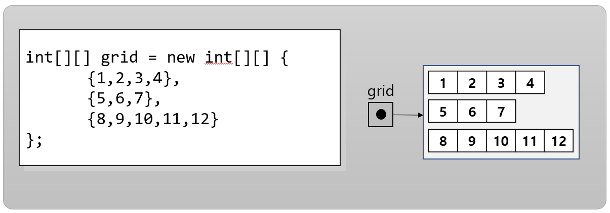

= 가변 길이 배열

* Java의 다차원 배열은 배열안에 다른 배열이 포함되어 있는 형태
* 배열 내의 각 배열은 다른 크기를 가질 수 있음
* 배열 인스턴스를 이니셜라이저로 초기화 할 때 내부 배열의 크기를 다르게 지정
* 배열 내 배열의 개수(행 수)를 결정한 후 포함된 배열의 크기를 지정

---

Java의 다차원 배열은 배열안에 다른 배열이 포함되어 있는 형태입니다. 따라서, 배열 내의 각 배열은 다른 크기를 가질 수 있습니다. 가변 길이 배열은 두 가지 방법으로 인스턴스를 초기화 할 수 있습니다.

== 배열 이니셜라이저로 초기화

배열을 선언할 때 이니셜라이저로 초기화 하면서 크기가 다른 가변 길이 배열 인스턴스를 생성할 수 있습니다.

[source, java]
----
int[][] grid = new int[][] {
    {1,2,3,4},
    {5,6,7},
    {8,9,10,11,12}
};
----

== 배열 내 배열의 수를 결정한 후 포함된 배열의 크기를 지정

배열을 선언한 후 초기화 할 때 첫 번째 배열(부모 배열)에 포함된 배열의 수(행 수)를 결정한 후 포함될 배열(자식 배열)의 크기를 결정하지 않고, new 키워드를 사용해서 배열 인스턴스를 초기화하면서 다른 크기의 배열로 인스턴스화 할 수 있습니다.

[source, java]
----
int[][] grid2 = new int[3][];
grid2[0] = new int[] {1,2,3,4};
grid2[1] = new int[] {5,6,7};
grid2[2] = new int[] {8,9,10,11,12};
----

link:./12_initate_multiple_dimension.adoc[이전: 다차원 배열 요소 초기화] +
link:./14_calcuated_length_array.adoc[다음: 계산된 크기를 가진 배열 생성]