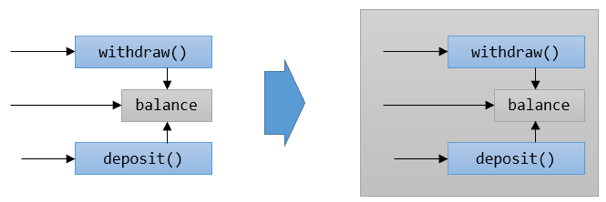

= 데이터와 메소드의 결합

* 데이터와 메소드를 하나의 캡슐로 결합
* 캡슐 경계는 내부와 외부를 결정

---

캡슐화(Encapsulation)에는 중요한 두 가지 관점이 있습니다.

* 데이터와 기능을 단일 개체로 결합
* 개체의 모든 멤버(메소드, 변수 등)에 대한 접근 가시성 제어

== 절차적 프로그래밍

전통적인 절차적 프로그래밍은 많은 데이터와 기능을 포함합니다. C와 같은 언어로 작성된 프로그램은 함수에서 모든 데이터에 접근할 수 있습니다. 프로그램의 규모가 작을 경우 이런 접근 방식이 좋을 수 있지만 프로그램이 커질수록 문제가 발생할 여지가 높아집니다. 큰 규모의 프로그램에서 데이터의 표현이 변경되면 관련된 모든 코드를 수정해야 합니다. 어떤 기능이 다른 기능에 대한 종속성이 있으면 관련된 모든 코드를 수정해야 하기 때문에 프로그램 개발이, 특히 수정이 어려워집니다. 

데이터와 함수가 분리되면 여러 다른 문제가 또한 발생할 수 있습니다. 사람의 사고는 기본적으로 추상화가 되어 있습니다. 사람이 자동차를 운전할 때 시동을 걸고 핸들을 조작하지 엔진룸을 열고 밸브에 직접 휘발유를 붓지 않습니다. 프로그램 또한 사람이 작성하고 사용하기 때문에 컴퓨터가 생각하는 방식보다는 사람이 생각하는 방식에 가까운 프로그래밍 모델을 사용하는 것이 좋습니다.

== 객체지향 프로그래밍

객체지향 프로그래밍은 이런 문제를 해결하기 위해 등장했습니다. 객체지향 프로그래밍 모델을 이해하고 제대로 사용한다면 자연스럽게 높은 추상화 수준에서 객체를 만들며 사용하게 됩니다. 객체 지향 프로그래밍은 사람지향 프로그래밍이라고 불러도 될 정도로 사람이 생각하는 방식에 가까운 프로그래밍 모델을 가지고 있습니다.
객체지향 프로그래밍의 첫 번째 단계는 데이터와 기능을 단일 엔티티로 결합하는 것입니다.

link:./06_encapsulation.adoc[이전: 캡슐화(encapsulation)] +
link:./08_visibility.adoc[다음: 접근 가시성 제어]