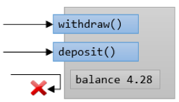
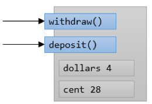

= 왜 캡슐화를 해야 하는가?

* 제어 허용
** 메소드를 통해서만 접근 가능하도록

* 변경 허용
** private 데이터 타입이 변경되어도 객체 사용에 영향을 미치지 않음

---

캡슐화를 하는 두 가지 목적은 다음과 같습니다:

* 사용 제어
* 변경의 영향 최소화

== 캡슐화는 제어를 가능하게 합니다

캡슐화의 첫 번째 이유는 사용을 제어할 수 있도록 하는 것입니다. 사람은 자동차를 운전할 때 자동차 내부는 생각하지 않고 운전만을 생각합니다. 은행 계좌에서 돈을 인출할 때 은행 내부의 프로세스는 생각하지 않습니다. 캡슐화와 동작 방법을 사용하여 프로그래머가 의도한 방식으로만 사용할 수 있도록 객체를 설계할 수 있습니다.

== 캡슐화는 변경을 가능하게 합니다

캡슐화의 두 번째 이유는 제어를 가능하게 하는데서 비롯됩니다. 객체의 구현 세부 정보가 비공개인 경우, 내부에서 변경할 수 있고, 그 변경이 사용자가 객체를 사용하는 방법에 영향을 미치지 않도록 할 수 있습니다. 메소드의 이름이 메소드가 구현되기 전에 정해지면, 그 자체로 행위의 이름이 됩니다. 이름을 잘 정하면 그 자체로 추상화의 일부가 됩니다.

내부에서 일어나는 변경을 수행하는 것은 추상화와 밀접한 관련이 있습니다. 메소드를 public으로 하여 외부에서 액세스 가능하게 할지 아니면 private으로 하여 외부 접근을 금지시킬지 결정할 수 있는 경우, 만약 private으로 결정했다면 메소드는 자유롭게 변경할 수 있습니다. 그리고 나중에 public으로 승격할 수도 있습니다. 그러나 공개 메소드가 삭제되거나 이름이 변경되는 등의 수정이 일어나면 객체를 사용하는 사용자의 코드도 수정되어야 합니다.

결론적으로, 공개되는 메소드는 어떤 변경에서 자유로워야 합니다. public으로 공개되어 객체 사용자가 액세스할 수 있는 메소드는 삭제하거나 수정이 어렵습니다. 로직이 변경되는 등의 변경이 일어날 때, 그 변경은 객체 내부에서만 일어나고 public으로 공개된 메소드를 사용하는데 영향을 주지 않도록 내부 변화와 외부 변화는 격리되어야 합니다.

link:./08_visibility.adoc[이전: 접근 가시성 제어] +
link:./10_object_data.adoc[다음: 객체 데이터]