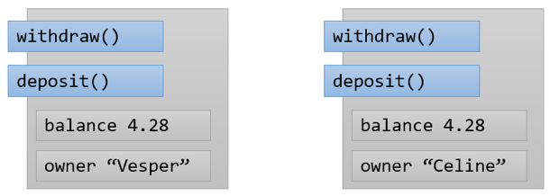

= 객체 데이터

* 객체 데이터는 개별 객체에 대한 정보를 설명
* 각 은행 계좌는 각 객체의 잔고를 가지고 있음
* 만약 잔고가 같다면 우연

---

객체 내부에서 static 데이터를 제외한 모든 데이터 항목은 각각의 객체에 대한 정보입니다. 모든 은행 계좌는 자체적으로 잔고를 가지고 있습니다. 두 잔고의 잔액이 동일하다면 그것은 우연의 일치일 뿐 같은 계좌는 아닙니다.

객체 내의 데이터는 private으로 유지되며 객체의 메소드를 통해서만 액세스 할 수 있도록 하는 것이 좋습니다. 이 캡슐화는 객체가 효과적으로 추상화되어 동작한다는 것을 의미하기도 합니다.

link:./09_why_encapsulation.adoc[이전: 왜 캡슐화를 해야 하는가?] +
link:./11_using_static_data.adoc[다음: 정적 데이터 사용]