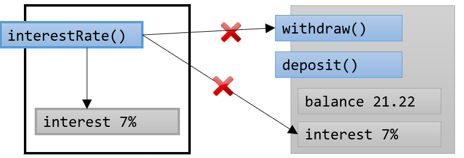

= 정적 메소드(Static Method) 사용

* 정적 메소드(Static Method)는 정적 데이터에만 액세스 할 수 있음
* 정적 메소드는 클래스에서 호출됨. 객체가 아님

---

정적 데이터를 캡슐화 하기 위해서는 정적 메소드를 사용해야 합니다. 은행 예에서 이자율은 각각의 계정 객체가 아니라 클래스에 속합니다. 따라서 객체의 이자율에 액세스는 메소드를 클래스 수준에서 정의해 주어야 합니다.

데이터를 정적으로 선언하는 것과 같은 방식으로 메소드를 정적으로 선언할 수 있습니다. public 또는 private 접근 제한자를 사용하여 정적 메소드와 정적 데이터 모두에 대한 접근 가능성을 제어할 수 있습니다. `public` 정적 메소드와 `private` 정적 메소드를 선택하여, 객체 데이터를 캡슐화 하는 것과 동일한 방식으로 정적 데이터를 캡슐화 할 수 있습니다.

정적 메소드는 클래스의 모든 `private` 멤버에 대해 액세스를 유지하고 객체 참조를 통해 `private` 동적 데이터(static이 아닌 데이터)에 액세스 할 수 있습니다.

[source, java]
----
class time {
    …
    public static void resetTime(time t) {
        t.hour = 0;
        t.minute = 0;
        hour = 0;	// 컴파일시 오류
        minute = 0;	// 컴파일시 오류
    }
    private int, minute;
}
----

link:./10_object_data.adoc[이전: 객체 데이터] +
link:./12_java_and_OOP.adoc[다음: Java와 객체지향]