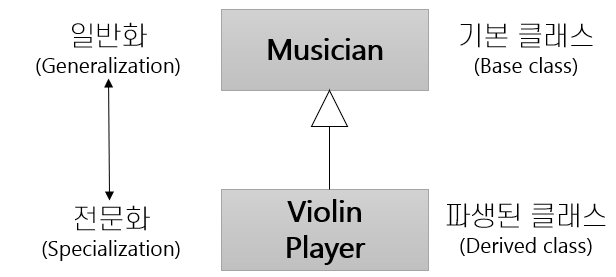

= 상속(Inheritance)

* 상속은 "is a kind of" 관계를 지정
* 상속은 클래스 사이의 관계
* 파생된 클래스는 존재하는 클래스에서 전문화됨

---

상속은 클래스 수준에서 지정되는 관계입니다. 새 클래스는 기존 클래스에서 파생될 수 있습니다. 그림에서, `ViolinPlayer` 클래스는 `Musician` 클래스에서 파생됩니다. 이 경우 `Musician` 클래스는 `ViolinPlayer` 클래스의 슈퍼 클래스(Super class) - 기본 클래스(Base class), 부모 클래스(Parent class) 라고 불리기도 합니다 - 라고 불리며, `ViolinPlayer` 클래스는 서브 클래스(Subclass) - 파생된 클래스(Derived class), 자식 클래스(Child class)라고 불리기도 합니다 - 라고 불립니다. 상속은 UML(Unified Modeling Language) 표기법을 사용하여 표시됩니다. 

서브 클래스는 슈퍼 클래스에서 모든 것을 상속합니다. 예를 들어 슈퍼 클래스 `Musician` 에 `TuneYourInstrument` 라는 메소드가 포함되어 있으면 이 메소드는 자동으로 서브 클래스 `ViolinPlayer` 클래스의 멤버가 됩니다.

슈퍼 클래스에는 여러 서브 클래스가 있을 수 있습니다. 예를 들어 `FlutePlayer` 나 `GuitarPlayer` 는 모두 `Musician` 클래스에서 파생될 수 있습니다. 이런 파생된 클래스는 슈퍼 클래스의 메소드를 자동으로 상속합니다.

== 객체지향 프로그램의 상속 이해

성인 남자와 여자, 여자 아이가 있는 그림을 생각해 봅시다. 남자와 여자가 그 아이의 생물학적 부모라면 여자 아이는 남자로부터 절반의 유전자를, 여자로부터 절반의 유전자를 물려받습니다.

이것은 클래스 상속의 예가 아닙니다. 

성인 남자와 여자, 여자 아이가 있는 그림을 객체지향적으로 생각한다면, `Man` 과 `Woman` 클래스가 있고, `Woman` 클래스의 인스턴스가 두 개, `Man` 클래스의 인스턴스가 하나 있는 것입니다. 이 예에서는 클래스간의 상속 관계가 없습니다. 상속관계를 꼭 만들어야 한다면 `Man` 와 `Woman` 두 클래스가 공유하는 행위와 속성들을 가지는 `Person` 클래스를 생성하고 `Person` 클래스가 `Man`, `Woman` 두 클래스의 슈퍼 클래스가 되는 것입니다. `Man`, `Woman` 은 `Person` 에서 전문화되어 각각의 `Person` 클래스의 동작과 속성에서 추가된 동작과 속성을 가지도록 모델링 되어야 합니다.

link:./20_oo_system.adoc[이전: 객체지향 시스템 정의] +
link:./22_hier.adoc[다음: 클래스 계층구조]
