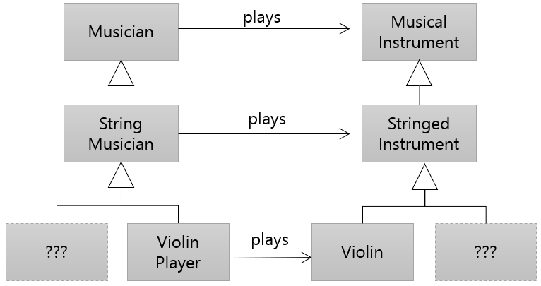

= 클래스 계층구조

* 상속과 관련된 클래스는 클래스 계층 구조를 형성

---

한 클래스의 서브 클래스는 그 자신이 다른 클래스의 슈퍼 클래스가 될 수 있습니다. 그림에서 `StringMusician` 클래스는 `Musician` 클래스에서 파생된 서브 클래스이지만 그 자체로 추가 파생된 `ViolinPlayer` 클래스의 슈퍼 클래스입니다. 상속으로 관련된 클래스 그룹은 클래스 계층구조(Class Hierarchy)로` 알려진 구조를 형성합니다. 계층 구조에서 위로 올라갈수록 일반적인 개념(일반화)을 나타내며 아래로 내려가면 보다 전문화된 개념(전문화)을 나타냅니다.

클래스 계층 구조의 깊이는 계층 구조의 상속 수준 수입니다. 더 깊은 클래스 계층은 얕은 클래스 계층보다 사용하기 어렵고 구현하기 더 어렵습니다. 대부분의 프로그래밍 지침에서는 깊이를 5~7개의 클래스로 제한할 것을 권장합니다.

그림은 두 개의 병렬 클래스 계층 구조를 보여줍니다. 하나는 `Musician` 이며, 다른 하나는 `MusicalInstrument` 입니다. 클래스 계층 구조를 만드는 것은 쉽지 않습니다. 클래스는 기본 클래스로 설계되어야 합니다. 상속으로 만들 수 있는 클래스 계층구조는 프레임워크의 기초가 되는 기능이며, 이를 기반으로 확장할 수 있는 모델이 됩니다.

link:./21_inheritance.adoc[이전: 상속(Inheritance)] +
link:./23_single_mult_inher.adoc[다음: 단일/다중 상속]