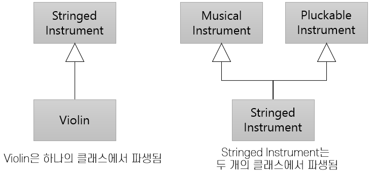

= 단일/다중 상속

* 단일 상속(Single Inheritance): 하나의 기본 클래스에서 파생됨
* 다중 상속(Multiple Inheritance): 하나 또는 그 이상의 클래스에서 파생됨

---

단일 상속(Single Inheritance)은 슈퍼 클래스가 하나 있을 때 발생합니다. 그림의 예에서  `Violin` 클래스는 `StringedInstrument` 하나의 클래스의 데이터와 속성을 상속하는 단일 상속의 예를 보여줍니다. 

다중 상속(Multiple Inheritance)은 `StringedInstrument` 는 두 클래스에서 파생되는 다중 상속의 예를 보여줍니다. 상속은 객체지향 모델링의 가장 강력한 도구이지만, 상속은 잘못 이해되고 오용할 수 있는 모델링 도구이기도 합니다. Java는 최신 프로그래밍 언어들과 마찬가지로 다중 상속에 제한을 둡니다. 클래스는 단 하나의 클래스에서만 상속할 수 있으며, 여러 인터페이스를 상속할 수 있습니다. `Interface`, `Abstract class`, `Concrete class` 등의 용어는 이 모듈의 뒷 부분에서 다룹니다.

모든 형태의 상속, 특히 다중 상속은 동일한 객체에 대해 여러 수준에서의 행위를 제공합니다. `Violin` 개체는 `Violin` 클래스 수준에서 사용할 수 있지만 `StringedInstrument` 수준에서도 동작합니다.

link:./22_hier.adoc[이전: 클래스 계층구조] +
link:./24_polymorphism.adoc[다음: 다형성(Polymorphism)]