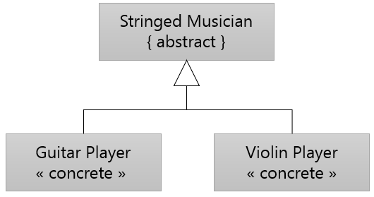

= 추상 클래스(Abstract Class)

* 파생되는 클래스의 기본 클래스가 되기 위해서만 존재
* 이런 종류의 클래스 인스턴스를 만드는 것은 의미가 없음
* 이런 클래스를 추상 클래스(abstract class)라고 부름

---

일반적인 클래스 계층 구조에서 operation(메소드 이름)은 기본 클래스에서 선언되고 메소드는 기본 클래스에서 파생되는 클래스마다 다른 방식으로 구현됩니다. 기본 클래스는 계층 구조에 메소드 이름을 주기 위해서만 존재하고 이런 operation에는 구현이 필요하지 않습니다. 이런 경우 클래스는 인스턴스화 되어 객체로 존재할 이유가 업습니다. 따라서 이런 클래스의 인스턴스를 생성할 수 없도록 해야 합니다. 이런 경우 클래스는 추상 클래스(abstract class)로 표시됩니다.

UML 디자인에서는 인스턴스화 될 수 없는 추상 클래스는 이름을 기울임체로 표시하거나 { abstract }를 사용해서 표시합니다. 추상 클래스가 아닌 일반 클래스는 « » 사이에 class 또는 concrete를 사용해서 인스턴스화 될 수 있는 클래스임을 표시합니다. 대부분의 객체지향 언어에는 인스턴스화 될 수 없는 클래스를 표시하는 문법이 있습니다. 

link:./24_polymorphism.adoc[이전: 다형성(Polymorphism] +
link:./26_interface.adoc[다음: 인터페이스(Interace)]
