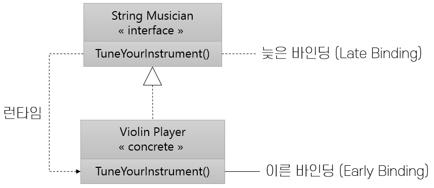

= 이른/늦은 바인딩(Early/Late Binding)

* 일반적인 메소드 호출은 컴파일시에 지정됨
* 다형적 메소드 호출은 런타임시에 지정됨

---

기본 타입의 operation을 통하지 않고 객체에서 직접 메소드를 호출하면 컴파일시에 메소드 호출이 지정됩니다. 이를 이른 바인딩(Early Binding) 또는 정적 바인딩(Dynamic Binding)이라고 합니다.
간접적으로 즉 기본 타입의 operation을 통해 메소드가 호출되면 이는 런타임에 지정됩니다. 이를 늦은 바인딩(Late Binding) 또는 동적 바인딩(Dynamic Binding)이라고 합니다.

늦은 바인딩을 오케스트라의 경우에 빗대어 생각해봅시다. 지휘자가 음악가들에게 조율을 지시하는 경우, 이른 바인딩을 한다면 지휘자는 "음악가"가 아닌 "기타 연주자" 또는 "바이올린 연주자"에게 조율을 지시해야 합니다. 늦은 바인딩의 경우라면 지휘차는 “기타 연주자” 또는 “바이올린 연주자”가 아닌 “음악가”에서 조율을 지시할 수 있습니다. 지휘자는 새 연주자가 추가되더라도 여전히 "음악가"에게 조율을 지시할 수 있습니다.

* 늦은 바인딩의 호출은 이른 바인딩보다 조금 느립니다. 늦은 바인딩 호출은 결과적으로 실제로 호출되는 객체를 검색하고 메소드를 찾아야 합니다. 프로그래밍 언어는 이를 효율적으로 처리하지만, 피해갈 수 없는 작업입니다.
* 늦은 바인딩을 사용하면 파생된 클래스(서브클래스)를 기본 클래스로 대체할 수 있습니다. 인터페이스를 통해 operation을 호출할 수 있으며 런타임에 파생된 클래스에서 해당 메소드가 올바르게 호출됩니다. 즉, 인터페이스를 구현하는 모든 파생된 클래스는 인터페이스 타입을 대체하는 역할을 할 수 있습니다. 이는 객체지향 프로그래밍에서 매우 중요한 개념입니다.

link:./26_interface.adoc[이전: 인터페이스(Interface)] +
link:./28_review.adoc[다음: 검토]
