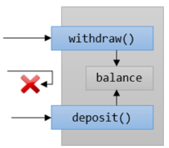

= 접근 가시성 제어

* 메소드는 public, 외부에서 볼 수 있음
* 데이터는 private, 내부에서만 볼 수 있음

image:./images/image02.png[]

---

아래 그림에서 인출(withdraw)과 입금(deposit), 잔액(balance)은 하나의 캡슐안에 단일화 되어 있습니다. 캡슐의 이름을 지정한다면 BankAccount 정도가 될 것입니다.

image:./images/image03.png[]
 
이 경우 심각한 문제가 있습니다. 사용자난 인출과 입금을 거치지 않고 잔액에 액세스 할 수 있습니다. 사람이 은행에 가서 금고 문을 열고 들어갈 수 없듯이, 이는 은행의 업무 방식이 아닙니다. 풀어야 하는 문제와 모델이 일치하지 않습니다.

캡슐화를 도구로 사용하면 이런 문제를 해결할 수 있습니다. 데이터와 기능이 하나로 결합되면 객체가 경계를 만들어 자연스럽게 외부와 내부로 나눕니다. 이 경계를 사용하여 개체의 액세스를 제어할 수 있습니다. 일부 기능과 데이터는 내부에서만 액세스 할 수 있고, 나머지는 내/외부 모두에서 액세스 할 수 있습니다. 경계 안과 밖 모두에서 액세스 할 수 있는 멤버(member)는 `public` 으로 정의되고 내부에서만 액세스 할 수 있는 멤버는 `private` 으로 정의됩니다.

은행 계좌를 모델링할 때 실세계의 은행 계좌에 가깝게 만들기 위해서 입금과 출금에 대한 방법만 외부에서 액세스 할 수 있게 하고 잔액에는 직접 액세스 할 수 없도록 해야 합니다. 잔액을 늘이는 유일한 방법은 입금 동작을 실행하는 것입니다. 잔액은 경계 내부에 있기 때문에 외부에서는 어떤 방법으로도 잔액에 액세스 할 수 없어야 합니다.
 
Java와 같은 객체지향 프로그래밍 언어는 경계의 내/외부에서 멤버에 액세스 할 수 있는 것에 대해 프로그래머가 결정할 수 있도록 합니다. 데이터를 외부로 직접 공개할 수 있습니다. 그러나 데이터는 항상 비공개로 지정하는 것이 좋습니다.

데이터 표현이 완전히 비공개인 유형으로 ADT(Abstract Data Type – 추상 데이터 타입)이라고 부릅니다. private 데이터 접근할 수 없고 그 데이터에 종속적이지 않다는 점에서 추상적이라고 할 수 있습니다. ADT에서는 행위만 사용할 수 있습니다.

기본 데이터 타입 역시 ADT의 일종이라고도 할 수 있습니다. int 변수를 선언하는 경우 컴퓨터가 정수를 이진으로 표현하는 방법에 대해 알 필요가 없습니다. 연산을 수행하는 동작의 이름인 사칙 연산(+, -, *, /)의 이름만 알면 됩니다.

객체의 멤버를 public으로 설정하면 동일한 개체에 다른 보기를 만들 수 있습니다. 외부에서 본 모양은 내부의 실제 모양의 하위 집합이 됩니다. 이런 보기에 대한 제한은 추상화와 밀접하게 관련됩니다.
객체지향 설계의 많은 부분이 동작을 내부에 배치할 지 외부에 배치할지에 대한 결정과 관련이 있습니다. 사용성이 유지되는 한 내부에 기능이 많이 배치되는 것이 유리합니다.

link:./07_data_method.adoc[이전: 데이터와 메소드의 결합] +
link:./09_why_encapulation.adoc[다음: 왜 캡슐화를 해야 하는가?]