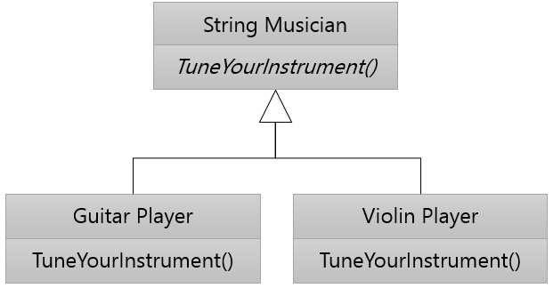

= 다형성(Polymorphism)

* 메소드 이름은 기본 클래스에 존재
* 메소드 구현은 파생된 클래스에 존재

---

다형성은 생물학에서는 같은 종의 생물이면서도 형태나 형질이 다양하게 나타나는 현상을 말합니다. 이를 객체지향에서는 하나의 객체가 여러 가지 타입을 가질 수 있는 것을 의미하며, 기본 클래스에 선언된 메소드가 파생된 클래스에 따라 다양한 방식으로 구현될 수 있다는 개념으로 설명합니다.

오케스트라의 악기 연주자들이 연주전에 악기를 조율하는 것을 생각해봅시다. 모든 음악가는 악기를 조율해야 하고, 각 악기는 조율하는 방법이 모두 다릅니다. 기타를 조율하는 방법과 바이올린을 조율하는 방법은 명확히 다릅니다. 이 경우 "현악기 음악가"는 모두 악기를 "조율"해야 합니다. 세부 악기를 조율하는 방법은 "기타 연주자"와 "바이올린 연주자"등 다른 악기를 연주하는 연주자 마다 다릅니다. 이렇듯이 "현악기 음악가"에게 "조율"이라는 공통적인 행위를 정의하고 “기타 연주자”나 “바이올린 연주자”가 다른 조율 방법을 가지도록 하는 것이 다형성(Polymorphism)입니다. 

만약 다형성이 없다면 지휘자는 각 음악가를 순서대로 방문하여 조율하는 방법을 지시해야 합니다. 객체가 다형적으로 구성되어 있다면 지휘자는 각 음악가에게 “악기를 조율하십시오”라고만 지시하면 됩니다. 지휘자는 각 음악가가 연주하는 특정 악기를 알 필요가 없으며, 각 음악가가 특정 악기에 대해 조율을 했는지 여부만 알면 됩니다. 이런 경우, 지휘자는 각 악기에 대한 조율을 책임지는 것이 아니라 책임을 분할합니다. 기타 연주자는 기타를 조율하는 방법을 알고, 바이올린 연주는 바이올린을 조율하는 방법을 알기 때문입니다. 사실 지휘차는 악기를 조율하는 방법을 모릅니다. 이 분산된 책임 할당(decentralized allocation of responsibility)은 기존 클래스를 수정할 필요없이 새로운 클래스, 예를 들면 CelloPlayer를 추가할 수 있다는 것을 의미합니다.

여기서 한 가지 생각해야 할 문제가 있습니다. 기본 클래스에서 정의한, 즉 구현을 서브클래스로 위임하는 메소드는 어떤 코드를 가져야 할까요? 이 문제는 기본 클래스에서 본문이 없는 메소드를 선언할 수 있습니다. 본문이 없는 메소드의 이름을 operation이라고 부릅니다. UML에서 본문이 없는 메소드는 기울임꼴로 나타냅니다.

link:./23_single_mult_inher.adoc[단일/다중 상속] + 
link:./25_abstract_class.adoc[다음: 추상 클래스]
