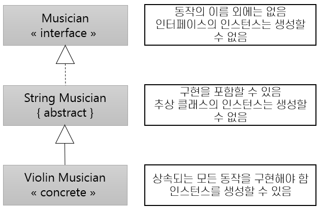

= 인터페이스(Interface)

* 인터페이스는 구현이 없는 operation의 이름만 포함

---

추상 클래스(abstract class)와 인터페이스(Interface)는 인스턴스화 할 수 없다는 점에서 비슷합니다. 차이점은 인터페이스는 타입의 정의를 위해 사용되고, 추상 클래스는 타입의 행위(Behavior)를 위해 사용된다는 점입니다. 초기의 인터페이스는 구현을 어떠한 종류의 구현을 포함하는 것을 허용하지 않았습니다. 추상 클래스는 멤버를 포함할 수 있습니다. 인터페이스는 operation(메소드 이름)만 포함하여 서브 타입에게 기능의 이름만 상속하고 구현을 강제합니다. 추상 클래스는 operation을 상속하지만 클래스의 멤버와 구현이 있는 메소드 역시 상속합니다. 인터페이스는 추상 클래스보다 훨씬 추상적입니다.

UML에서 인터페이스는 « » 사이에 interface를 써서 표시합니다. 대부분의 객체지향 언어에는 인터페이스를 위한 문법을 제공합니다.

인터페이스는 객체지향 프로그래밍에서 다른 클래스 등과 구분되는 중요한 부분입니다. 인터페이스는 구현을 상속하지 않고, 구현을 강제합니다. 따라서 클래스가 인터페이스에서 파생되면 이를 구현(Implement)한다고 하고, UML에서는 실제화(realization)라고 하는 점선 화살표로 표시합니다. 클래스가 클래스(추상 클래스 또는 콘크리트 클래스)에서 파생되는 것을 확장(Extends)라고 합니다. UML에서는 이를 일반화/전문화(generalization/specialization)이라고 하며 실선 화살표로 표시합니다.

인터페이스는 클래스 계층 구조의 제일 위에 배치됩니다. 인터페이스는 operation만들 표시하고, 인터페이스에서 파생되는 클래스가 인터페이스에 선언된 operation들만을 사용하는 경우 프로그램은 파생된 클래스에 대해 종속성을 가지지 않습니다. 인터페이스를 기준으로 프로그래밍 하면 인터페이스에서 파생된 모든 클래스는 인터페이스 타입으로 동작할 수 있으며, 파생된 클래스에서의 변경이 영향을 프로그램에 영향을 미치지 않게 됩니다.

link:./25_abstract_class.adoc[이전: 추상 클래스(Abstract Class)]
link:./27_early_late_binding.adoc[다음: 이른/늦은 바인딩(Early/Late Binding)]