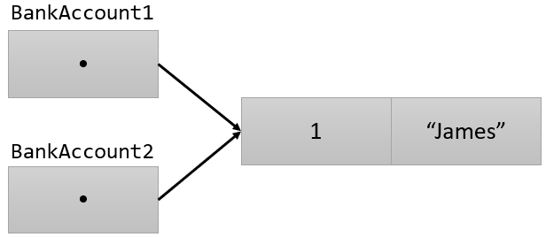

= 같은 객체에 대한 여러 변수의 참조

* 하나의 객체에 대한 여러 변수의 참조
** 두 참조 변수에서 읽기/쓰기는 같은 객체에 적용됨

[source, java]
----
BankAccount account = new BankAccount();
account.accountNumber = 1;
account.ownerName = “James”;
BankAccount account2 = account;
System.out.println(account2.accountNumber);
System.out.println(account2.ownerName);
----

---

다른 두 참조 타입 변수는 같은 객체를 참조할 수 있습니다. 참조 타입 변수는 객체가 있는 곳의 값을 저장하기 때문입니다. 이는 같은 객체를 참조하고 있는 두 변수 중 하나의 변수에서 수정이 발생하면 두 변수 모두 영향을 받는다는 것을 의미합니다.

== 같은 객체에 대한 여러 변수의 참조

예제에서, `account1` 과 `account2` 는 같은 객체를 가리킵니다. `account1` 은 `new` 연산자를 사용하여 초기화되었고, `accountNumber` 멤버와 `ownerName` 멤버에 값이 할당되었습니다. 그리고 `BankAccount` 타입의 `account2` 에 복사되었습니다. 그리고 두 변수의 값을 출력합니다.

[source, java]
----
BankAccount account1 = new BankAccount();
account1.accountNumber = 1;
account1.ownerName = "James";
----

account2의 값은 account1 변수에 할당한 값과 동일합니다.

----
1
James
----

`account2` 를 `account1` 에 할당하면 두 참조 타입 변수가 동일한 객체를 참조하도록 참조가 복사됩니다. 즉, 객체가 존재하는 위치가 복사됩니다. 따라서 `account2` 는 `account1` 에 할당한 값과 동일한 값을 출력합니다. 위 코드에서 변수는 두 개지만 객체는 하나입니다.

== 같은 객체를 참조하는 변수의 값을 변경

아래 예제는 `account1` 변수의 값을 변경한 후 `account2` 변수의 값을 확인합니다. 

[source, java]
----
account1.accountNumber = 2;
account1.ownerName = "Jason";

System.out.println(account2.accountNumber);
System.out.println(account2.ownerName);
----

출력은 아래와 같습니다.

----
2
Jason
----

결과는 `account1` 변수를 변경한 값을 보여줍니다. `account1` 과 `account2` 두 변수는 같은 객체를 가리키고 있기 때문에, `account1` 을 통해 변경한 값은 `account2` 에도 당연히 영향을 미칩니다.

link:./06_comparision.adoc[이전: 값 타입의 비교와 참조 타입의 비교] +
link:./08_ref_as_parameter.adoc[다음: 메소드 파라미터에 참조 타입 사용]