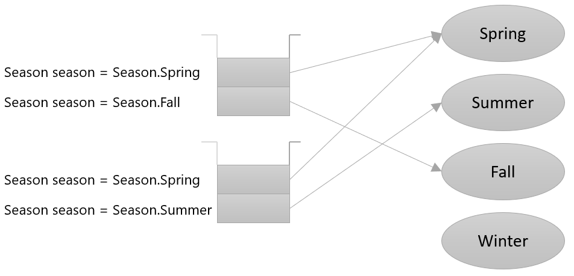

= enum 값 비교

* enum 객체는 Heap 영역에 저장됨
* enum 객체가 생성되면, 모든 enum 변수는 생성된 enum 객체의 위치를 가리킴
** 동등 값 비교: equals 또는 ==
** 비교 연산자 < >. <=, >=는 값을 비교하지 않음

---

enum 객체는 참조 타입입니다. enum 객체는 초기화되면 Heap 영역 메모리에 생성됩니다. 한 가지 주의할 점은, enum 객체를 생성할 때 `new` 연산자를 사용하지 않는다는 것입니다. 이는 enum 객체가 생성될 때 새 메모리 영역을 할당하지 않는다는 것입니다.

enum 역시 내부적으로 생성자가 존재하지만 클래스가 로드되는 시점에서 생성되기 때문에 임의로 생성할 수 없습니다. `new` 로 생성되지 않는 enum은 모든 enum 객체 변수가 같은 곳에 생성되어 있는 객체를 참조하게 됩니다.

== enum 값 비교

`==` 연산자가 참조 타입간에 사용되면 같은 객체를 참조하고 있는지를 비교합니다. 같은 값을 가지고 있는 enum 변수는 같은 객체를 참조하게 되고, 같은 값을 가진 enum 변수를 == 로 비교하면 true를 return 합니다. 

따라서, enum 객체간의 ==은 값을 비교한 것과 같은 효과를 냅니다. `equals` 메소드 역시 동일하게 동작합니다.

[source, java]
----
Suit suit1 = Suit.Spade;
Suit suit2 = Suit.Spade;
Suit suit3 = Suit.Club;

suit1 == suit2;	        // true
suit1.equals(suit2);	// true
suit1 == suit3;	        // false
suit1.equals(suit3);	// false
----

enum 간에는 <, >, <=, >= 등의 비교를 사용할 수 없습니다.

link:./10_declare_enum.adoc[이전: enum 타입 선언] +
link:./12_enum_method.adoc[다음: enum 타입 메소드]