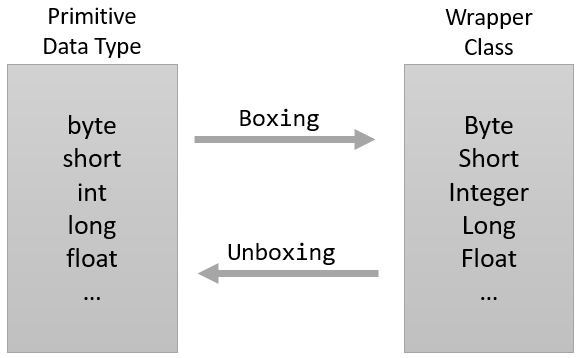

= Boxing과 Unboxing

* Wrapper 클래스는 산술 연산을 위해 정의되지 않음
* 값을 변경할 수 없음
* 기본 데이터 타입을 Wrapper 클래스 인스턴스로 변환: Boxing
* Wrapper 클래스 인스턴스를 기본 데이터 타입으로 변환: Unboxing

---

Wrapper 클래스는 산술 연산을 위해 정의된 클래스가 아니므로, 인스턴스에 저장된 값을 변경할 수 없습니다. Value world의 값을 Reference world로 가져가서 객체처럼 사용하기 위한 목적으로 사용되어, 생성된 인스턴스의 값을 참조만 할 수 있습니다.

 
위 그림과 같이 기본 데이터 타입을 Wrapper 클래스의 인스턴스로 변환하는 과정을 Boxing이라고 하며, 반대로 Wrapper 클래스를 기본 데이터 타입으로 변환하는 과정을 Unboxing이라고 합니다.

[source, java]
----
Integer number = new Integer(20);		// Boxing
int i = number.intValue();			// Unboxing
----

== Auto Boxing, Auto Unboxing

Java 컴파일러는 Boxing과 Unboxing이 필요한 상황이 되면 이 작업 자동으로 처리합니다. 이런 자동화된 Boxing과 Unboxing을 Auto Boxing, Auto Unboxing이라고 합니다.

[source, java]
----
Integer number = 1;
int i = number;
----

link:./31_wrapper_class.adoc[이전: Wrapper 클래스] +
link:./33_super_sub_casting.adoc[다음: 슈퍼클래스/서브클래스 변환]