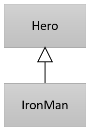

= instanceof 연산자

* 객체의 타입을 확인하는데 사용
* 변환 가능하면 true를 반환

[source, java]
----
Hero hero;

if (h instanceof Hero) {
    hero = (Hero)ironMan;
}
else {
    System.out.println("Not a hero");
}
----

---

호환되지 않은 타입 변환을 시도하다 발생하는 `ClassCastException` 과 같은 타입 변환 오류는 예외로 처리할 수 있습니다. 한 가지 방법이 더 있는데, `instanceof` 연산자를 사용하는 것입니다.

변환을 수행하기 전에 `instanceof` 연산자를 사용하여 변환 가능한 타입인지 체크할 수 있습니다. 만약 아래와 같은 클래스 계층구조가 있다면,

 
아래 코드에서 `if` 문은 `true` 를 반환합니다. 타입 변환이 실행되기 전에 형 변환 가능 여부를 체크할 수 있습니다.

[source, java]
----
if (h instanceof Hero) { 	// true를 반환
    hero = (Hero)ironMan;
}
else {
    System.out.println("Not a hero");
}
----

참조 타입의 타입 변환에서, 가능한 타입 변환은 “is a kind of” 즉, “한 종류인 경우”에 가능합니다. “새는 동물의 한 종류입니다” 관계가 성립되면 타입 변환은 언제나 성공합니다. 그러나 그 반대의 경우, 즉 “동물이 새의 한 종류입니다”는 성립하지 않습니다. 만약 IronMan은 Hero의 한 종류이지만, Hero는 IronMan의 한 종류가 아닙니다. 
따라서, IronMan을 Hero로 타입 변환하는 것은 언제나 성공하지만 Hero를 IronMan으로 변환할 수는 없습니다. 따라서, 아래 if 문은 false를 반환합니다.

[source, java]
----
Hero h = new Hero();
if (h instanceof IromMan)
----

link:./33_super_sub_casting.adoc[이전: 슈퍼 클래스/서브 클래스 변환] +
link:./35_object_casting.adoc[다음: Object 타입 변환]