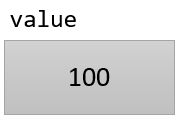
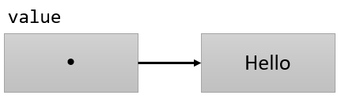

= 값 타입과 참조 타입 비교

* 값 타입(Value Type)
** 데이터를 직접 포함
** 복사된, 직접 가지는 데이터를 저장
+
----
int value;
value = 100; 
----
+

* 참조 타입(Reference Type)
** 데이터(객체)가 있는 곳의 위치를 저장
** 데이터는 분리된 메모리 영역에 저장됨
+
----
String value;
Value = “Hello”
----

---

Java는 int, long, byte와 같은 기본 데이터 타입(primitive data type)을 제공합니다. 이 타입들은 값 타입(Value Type)이라고도 부릅니다. Java와 같은 객체지향 언어는 복잡하고 강력한 데이터를 처리하기 위해 참조 타입(Reference Type)을 제공합니다.

* 값 타입(Value Type) +
값 타입 변수는 자바에서 제공하는 8개의 기본 데이터 타입입니다. 값 타입 변수는 단순하게 동작하며, 선언된 변수는 변수 자체에 저장됩니다.
* 참조 타입(Reference Type) +
참조 타입은 데이터가 아닌 데이터가 저장된 곳의 위치 값을 저장합니다. 데이터는 분리된 메모리 공간에 저장됩니다.

앞에서 사용했던 String, 배열, 예외는 모두 Java가 기본적으로 제공하는 참조 타입에 해당합니다. 실습에서 알 수 있듯이 Java에서는 사용자 정의 클래스를 만들어 인스턴스화 하여 객체로 사용할 수 있고, 이런 종류의 객체는 모두 참조 타입으로 동작합니다.

link:./02_reference.adoc[이전: 참조 타입] +
link:./04_declare_release.adoc[다음: 참조 타입 변수의 선언과 해제]