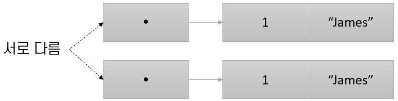

= 값 타입의 비교와 참조 타입의 비교

* 값 타입의 비교
** == 연산자와 != 연산자를 사용하여 값을 비교
* 참조 타입의 비교
**  == 연산자와 != 연산자는 값이 아닌, 참조를 비교

---

==연산자와 != 연산자는 참조 변수에 대해 값 타입에서와 같은 방식으로 동작하지 않습니다.

* 값 타입 비교 +
값 타입에서, == 연산자와 != 연산자는 변수의 값을 비교합니다.

* 참조 타입 비교 +
String과 같은 참조 타입의 경우, == 및 != 연산자는 두 참조 타입 변수가 동일한 객체를 참조하는지 여부를 비교합니다. 변수가 가진 값을 비교하지 않습니다. 

아래 예에서 두 `BankAccount` 타입 객체는 값은 값을 가지고 있습니다. 

[source, java]
----
BackAccount account1 = new BankAccount();
account1.accountNumber = 1;
account1.ownerName = “James”;

BackAccount account2 = new BankAccount();
account1.accountNumber = 1;
account1.ownerName = “James”;

if (account1 == account2)
    System.out.println("Same");
else
    System.out.println("Different");
----

코드를 실행하면 Different를 출력합니다. `account1` 의 값과 `account2` 의 값은 명확히 동일하지만, 두 참조 타입 변수는 서로 다른 객체를 참조하기 때문에 == 연산자는 `false` 를 return 합니다. 

참조 타입 변수를 비교하기 위해 관계 연산자(<, >, <=, >=)를 사용할 수 없습니다. 

link:./05_ref_variable.adoc[이전: 초기화 되지 않은 참조 타입 변수] +
link:./07_same_ref.adoc[다음: 같은 객체에 대한 여러 변수의 참조]